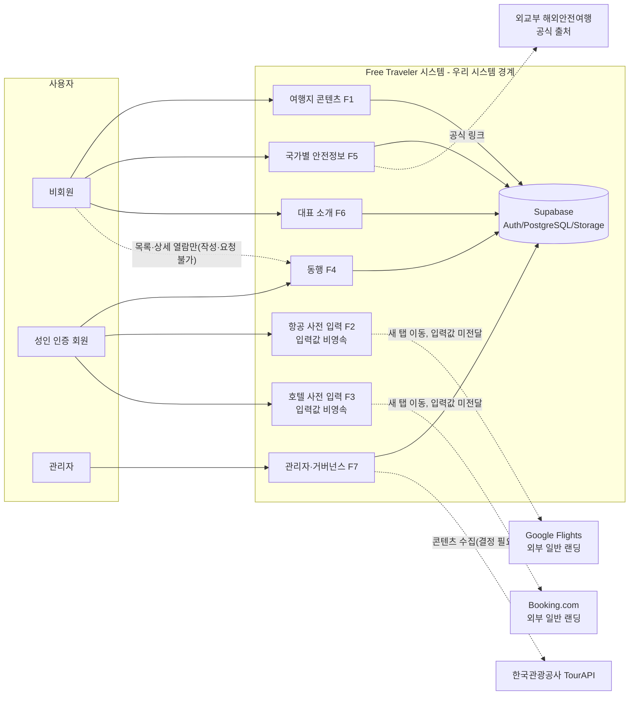
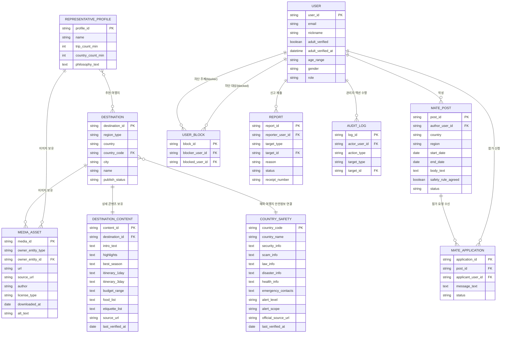
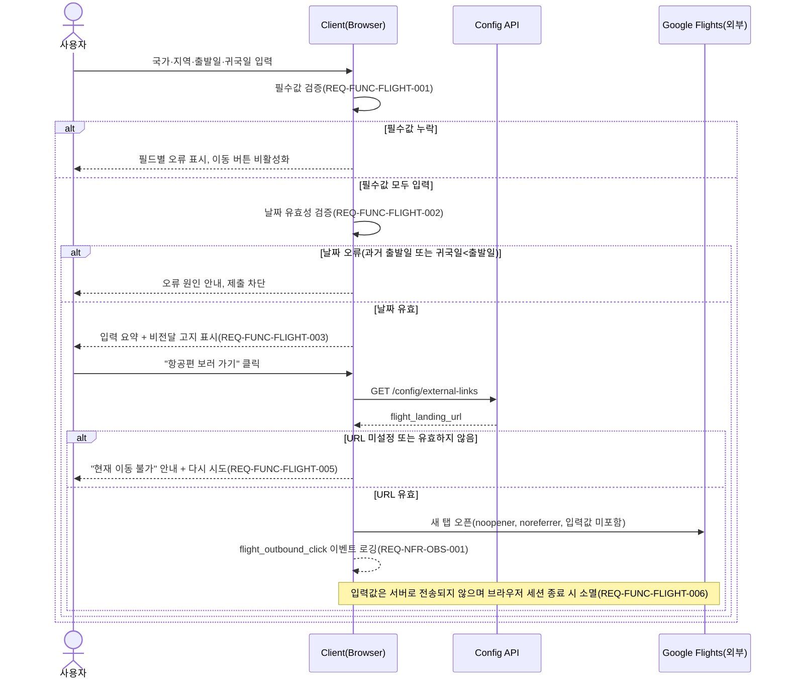
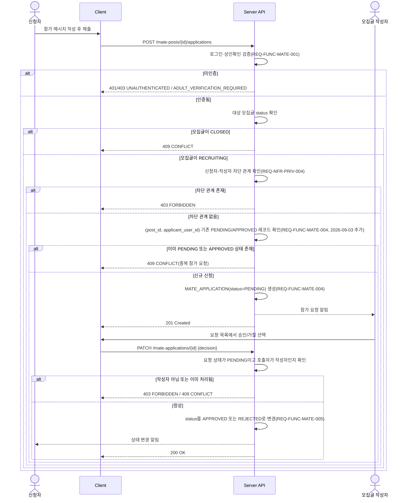
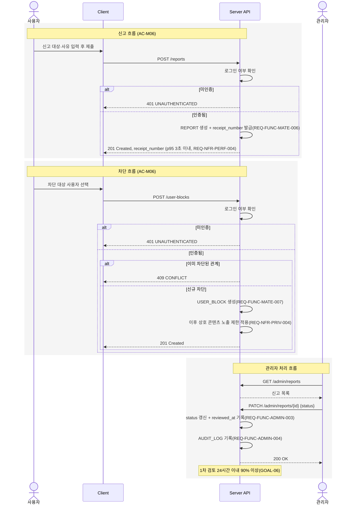
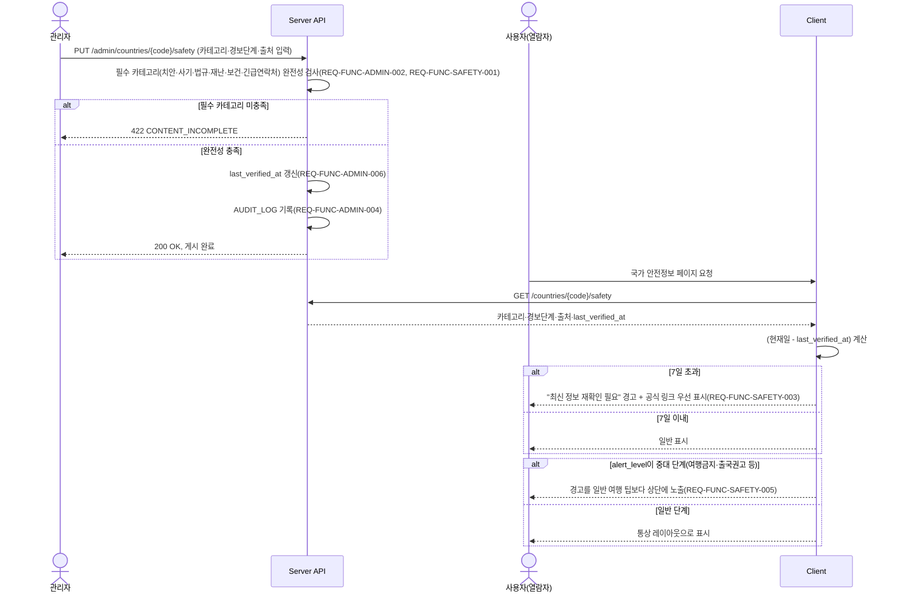

# Free Traveler 여행 탐색·외부 연결·동행·안전정보 플랫폼 SRS v1.0

## 0. 문서 정보

| 항목 | 내용 |
|---|---|
| Document ID | SRS-TRAVEL-001 |
| Version | **1.0** |
| 상태 | **Baseline** — 채팅에서 사용자가 명시적으로 승인한 수정 사항만 반영. 승인되지 않은 제안은 포함하지 않음(§0-2 참조) |
| 상위(Parent) PRD | `00_PRD_Travel_v1.md`(PRD-TRAVEL-001, 2026-09-03 개정판 — §13 개정 이력 포함) |
| 선행 버전 | `SRS_Drafts/SRS_Travel_integrated_v0_4.md`(Draft v0.4.1, Critical/Major 결함 반영본) |
| Owner | Product & Engineering |
| 대상 플랫폼 | 반응형 웹(Mobile First) |
| 작성일 | 2026-09-03 |

### 0-1. 변경 요약 (v0.4.1 → v1.0)

> `04_SRS_Travel_review.md`에서 Critical 5건·Major 14건으로 분류되고, 사용자가 채팅에서 "PRD 문서 및 SRS_Drafts 폴더의 문서를 기반으로 필요한 부분들을 수정해줘"라고 명시적으로 승인한 수정 사항만 아래 표와 같이 반영했다. Minor 항목과 순수 정책 결정(성인 인증 방식, 연락처 탐지 패턴 범위 등)은 반영 범위에서 제외했다 — 해당 항목은 §14 Open Questions에 그대로 남아 있다.

| 구분 | 반영 내용 | 관련 절 |
|---|---|---|
| Critical | 비회원의 동행 목록·상세 열람 허용(PRD AC-M02 수정과 정합) | §5-4 REQ-FUNC-MATE-002, §10-4, §4-4 |
| Critical | 회원 탈퇴 시 개인정보 파기 요구사항 신설, USER 상태에 DEACTIVATED 추가 | §6-4 REQ-NFR-PRIV-007, §7-6 |
| Critical | 사용자 입력 콘텐츠(모집글 본문 등) 새니타이제이션 요구사항 신설 | §6-3 REQ-NFR-SEC-008 |
| Critical | North Star·보조 KPI 측정에 필요한 누락 이벤트 추가 | §6-6 REQ-NFR-OBS-001 |
| Critical | 근거 없는 "정원(capacity)" 개념 제거 | §5-4 REQ-FUNC-MATE-005, §14 OQ-15 |
| Major | REQ-FUNC-ADMIN-001(4개 엔터티 CRUD 통합) 분리 | §5-7 REQ-FUNC-ADMIN-001·001-2 |
| Major | REQ-FUNC-DEST-003(11개 항목 통합) 서브 테스트케이스로 분리 | §5-1, §15-1 |
| Major | REQ-FUNC-MATE-002 "겹치는" 필터 매칭 규칙 명시 | §5-4 REQ-FUNC-MATE-002 |
| Major | "안전수칙" 동의 대상 최소 구성요소 정의 | §5-4 REQ-FUNC-MATE-003 |
| Major | WCAG AA 게시 게이트 기준 구체화 | §6-5 REQ-NFR-ACC-001 |
| Major | 연락처 탐지율 95% 측정 방법론 명시 | §5-4 REQ-FUNC-MATE-009 |
| Major | 외부 랜딩 URL 조회 방식이 미결정임을 다이어그램에 각주로 명시 | §12-1 |
| Major | 호텔 외부 링크 오류 처리 요구사항 신설(항공과 대칭) | §5-3 REQ-FUNC-HOTEL-007 |
| Major | Supabase 장애 시 최소 대응 요구사항 신설 | §6-2 REQ-NFR-AVAIL-003 |
| Major | 성능 NFR의 단계별(Alpha~Public Beta) 적용 원칙 명시 | §6-1 서두 |
| Major | 참가 요청 중복 제출 방지(유일 제약) 요구사항 추가 | §5-4 REQ-FUNC-MATE-004, §7-8 |
| Major | 로그인 시도 제한·세션 만료·관리자 계정 보호 요구사항 신설 | §6-3 REQ-NFR-SEC-005~007 |
| Major | Should 우선순위 기능의 SRS 범위 제외를 명시적으로 선언 | §2-5(신설) |
| Major | §10 API 절의 비구속적(Non-normative) 성격을 강화 명시 | §10 서두 |

### 0-2. 이번 버전에 반영하지 않은 사항

> 같은 대화에서 사용자는 이어서 "구현·운영 가능성" 관점의 재검토(요구사항별 유지/축소/MVP 이후/삭제/정책 결정 필요 제안)를 요청했다. 이때 사용자는 "파일을 수정하지 말고 먼저 채팅으로 결과를 보여주세요"라고 명시했고, 그 결과에 대한 승인 발언은 이번 대화에서 아직 없었다. 따라서 다음은 **본 문서에 반영하지 않았다**:
> - REQ-FUNC-MATE-008(자동 마감 배치)을 수동 운영으로 축소하는 제안
> - REQ-FUNC-ADMIN-001/001-2/002의 구현을 Supabase Table Editor 기반으로 축소하는 제안
> - REQ-NFR-AVAIL-003(Supabase 장애 대응)을 MVP 이후로 미루는 제안
> - REQ-NFR-ACC-001(WCAG AA 게이트)을 Public Beta 이전에는 권고로 완화하는 제안
> - REQ-NFR-CONTENT-001(SEO 메타데이터)을 MVP 이후로 미루는 제안
> - TourAPI 연동을 MVP 이후 수동 대체로 명문화하는 제안, 관리자 역할 단일화를 명문화하는 제안 등
>
> 위 제안들은 모두 Must 우선순위를 그대로 유지한 채 원본(v0.4.1) 상태로 보존했다. 사용자가 이후 승인하면 별도 개정판(v1.1 등)에 반영한다.

### 0-3. 문서 구성·이력 원칙 (v0.4 통합 당시 규칙 — 계보 보존)

1. 요구사항 ID와 PRD 출처는 원본에서 임의로 변경하지 않는다.
2. 승인되지 않은 기능은 추가하거나 삭제하지 않는다(PRD 제품 범위 유지).
3. 통합·개정 과정에서 발견한 충돌은 §13 "통합 시 발견한 충돌과 해결 현황"에 기록한다.
4. 결정되지 않은 사항은 모두 §14 Open Questions에 남긴다.
5. §15에 PRD → SRS Requirement → Test Case Traceability Matrix를 둔다.
6. §16 Definition of Done, §17 MVP Release Criteria를 포함한다.
7. 모든 다이어그램·표는 Markdown/Mermaid 문법 유효성을 확인한다.

> 본 문서는 `SRS_Drafts/01_SRS_Travel_scope_v0_1.md`, `02_SRS_Travel_requirements_v0_2.md`, `03_SRS_Travel_design_v0_3.md`를 통합한 `SRS_Travel_integrated_v0_4.md`(Draft v0.4)에, 리뷰(`04_SRS_Travel_review.md`) 기반 Critical/Major 수정을 반영한 v0.4.1을 거쳐 완성된 베이스라인이다. 원본 초안 파일들은 이 과정에서 직접 수정하지 않았다.

---

## 1. Introduction

### 1-1. Purpose

본 SRS는 PRD-TRAVEL-001의 Feature·Story·Acceptance Criteria를 식별 가능한 소프트웨어 요구사항과 테스트 케이스로 변환하여 구현 기준 문서로 사용하기 위해 작성한다. (출처: PRD 하단 "다음 단계")

### 1-2. Product Summary

Free Traveler는 여행지를 탐색(Discover)하고, 국가·지역·기간을 정리해 조건을 명확히 하며(Decide), 항공·호텔 외부 서비스 또는 동행자와 연결하고(Connect), 국가별 안전정보를 공식 출처로 검증하며(Stay Safe), `free_traveler`의 경험과 편집 기준을 신뢰할 수 있는(Trust the Curator) 여행 준비 허브다. (출처: §1-1 비전, §3-1 가치 제안)

제품은 실제 항공·호텔 검색 결과나 예약·결제 기능을 제공하지 않으며, 외부 사이트로의 이동 전 조건 정리와 요약 확인까지만 담당한다. (출처: §2-3 원칙2·3, §5-1 Won't, §9-2)

### 1-3. Definitions

| 용어 | 정의 | 출처 |
|---|---|---|
| 여행지(Destination) | 국내·해외 국가·도시 단위의 게시 콘텐츠 단위 | §3-3, §8-1 `DESTINATION` |
| 국가별 주의사항(Country Safety) | 국가·지역별 치안·법규·재난·보건·긴급연락처 및 공식 출처·확인일 정보 | §8-1 `COUNTRY_SAFETY`, Story 5 |
| 동행 모집글(Mate Post) | 성인 인증 회원이 작성하는 동행 모집 조건과 상태 정보 | §8-1 `MATE_POST`, Story 4 |
| 참가 요청(Application) | 동행 모집글에 대한 참가 신청과 승인·거절 상태 | §8-1 `MATE_APPLICATION`, AC-M04 |
| 성인 확인(Adult Verification) | 만 19세 이상 여부와 확인 시각만 저장하는 확인 상태(생년월일 미저장) | §7-2, AC-M01 |
| 외부 일반 랜딩 페이지(External General Landing Page) | 입력값이 전달되지 않는, 설정된 항공·호텔 외부 사이트의 일반 페이지 | AC-F04, AC-H04, §8-2 |
| 비전달 고지(No-transfer Notice) | 항공·호텔 입력값이 외부 사이트나 서버로 전달·저장되지 않음을 알리는 안내 문구 | AC-F03, AC-H03, §2-3 원칙3 |
| 대표(Representative) | `free_traveler`의 여행 경험·철학을 소개하는 브랜드 프로필 | §6-1 `REPRESENTATIVE_PROFILE` |
| 차단(User Block) | 사용자 간 상호 콘텐츠 노출을 제한하는 관계 | §8-1 `USER_BLOCK`, AC-M06 |
| 신고(Report) | 사용자가 제출하는 신고 대상·사유와 관리자 처리 상태 | §8-1 `REPORT`, AC-M06 |

### 1-4. References

| ID | 출처 | 활용 |
|---|---|---|
| REF-01 | 외교부 해외안전여행 — https://www.0404.go.kr/ | 국가·지역별 여행경보, 안전공지 원문 |
| REF-02 | 한국관광공사 국문 관광정보 서비스 — https://www.data.go.kr/data/15101578/openapi.do | 국내 관광정보·이미지 후보 |
| REF-03 | 개인정보 보호법 제16조 — https://www.law.go.kr/법령/개인정보보호법 | 최소 개인정보 수집 원칙 |
| REF-04 | WCAG 2.2 — https://www.w3.org/TR/WCAG22/ | 접근성 Level AA 목표 |
| REF-05 | Unsplash License — https://unsplash.com/license | 이미지 이용조건 |
| REF-06 | Pexels License — https://www.pexels.com/license/ | 이미지 이용조건 |
| REF-07 | Google Flights — https://www.google.com/travel/flights | 항공 외부 일반 랜딩 후보 |
| REF-08 | Booking.com — https://www.booking.com/ | 호텔 외부 일반 랜딩 후보 |
| REF-09 | `00_PRD_Travel_v1.md`(PRD-TRAVEL-001) | 본 SRS의 기반 문서 |
| REF-10 | `SRS_Drafts/00_PRD_분석.md` | PRD 근거 수준 분류 참고 문서 |

(REF-01~08 출처: PRD §12)

---

## 2. Scope

### 2-1. In Scope

> PRD §9-1 원문을 변경하지 않고 그대로 인용한다.

- 국내 10개 이상, 해외 15개국 30개 도시 이상의 여행지 콘텐츠
- 소개되는 해외 15개국 전체의 국가별 주의사항
- 항공·호텔 국가·지역·기간 입력, 요약 확인, 외부 일반 페이지 이동
- 반응형 웹과 모바일 우선 UX
- 만 19세 이상 동행 모집·검색·참가 요청·승인·거절·신고·차단
- `free_traveler` 대표 소개 페이지
- 콘텐츠·이미지·안전정보·신고 관리자 기능
- 기본 행동 분석과 운영 로그

(출처: §9-1)

### 2-2. Out of Scope

> PRD §9-2 원문을 변경하지 않고 그대로 인용한다.

- 실제 항공편·호텔 검색 API와 검색 결과
- 외부 사이트로의 입력값 자동 전달
- 가격 비교, 가격 알림, 예약 재고 확인
- 예약·발권·결제·취소·환불 고객지원
- 동행자 실시간 채팅, 영상통화, 위치 공유
- 미성년자 동행 서비스
- 정부 발급 신분증 기반 신원 보증
- 사용자 자유 리뷰·별점·무제한 커뮤니티
- 법률·의료·비자 승인에 대한 보증
- 출처 확인 없이 생성된 여행·안전 콘텐츠
- 네이티브 앱과 다국어 지원

(출처: §9-2)

### 2-3. Assumptions

| ID | 가정 | 검증 방법 | 출처 |
|---|---|---|---|
| A-01 | 외부 항공·호텔 일반 페이지를 새 탭으로 연결할 수 있다 | 출시 전 실제 브라우저 링크 점검 | §10-2 |
| A-02 | 입력값을 전달하지 않아도 사전 조건 정리가 사용자에게 가치를 준다 | Closed Beta 과제 완료 시간·만족도 측정 | §10-2 |
| A-03 | 초기 사용자는 한국어 사용자다 | Beta 유입·브라우저 언어 분석 | §10-2 |
| A-04 | 안전정보는 외교부 해외안전여행을 최우선 공식 출처로 사용한다 | 운영 체크리스트 검수 | §10-2 |

### 2-4. Constraints

| ID | 제약 | 출처 |
|---|---|---|
| C-01 | 항공·호텔 입력값(국가·지역·날짜)은 외부 사이트로 전달하지 않는다 | §2-3 원칙3, AC-F06, AC-H05, §7-2 |
| C-02 | 항공·호텔 입력값은 서버 DB에 저장하지 않고 브라우저 상태로만 유지한다 | §2-3 원칙3, AC-F06, §7-2 |
| C-03 | 외부 이동은 `noopener`, `noreferrer`를 적용한 새 탭 링크만 사용한다 | §7-2 |
| C-04 | 대상 플랫폼은 반응형 웹(Mobile First)이며 네이티브 앱은 범위에 포함하지 않는다 | PRD 헤더, §9-2 |
| C-05 | 다국어는 지원하지 않는다(한국어 단일) | §9-2, A-03 |
| C-06 | 동행 서비스는 만 19세 이상 회원만 이용할 수 있으며 미성년자 동행은 제공하지 않는다 | §5-1 Won't, §9-2, AC-M01 |
| C-07 | 정부 발급 신분증 기반 신원 보증은 제공하지 않는다 | §9-2 |
| C-08 | 회원·동행·콘텐츠 데이터는 Supabase(PostgreSQL, Auth, Storage)를 사용한다 | §8-2, D-01 |
| C-09 | 동행 요청 알림 이메일(Should 우선순위 기능)을 구현할 경우에만 이메일 알림 서비스가 필요하다(MVP Must 범위의 필수 조건 아님, 2026-09-03 명확화) | D-02(2026-09-03 개정), §5-1 Should — ※ §13 충돌 C4 참조(해결됨) |
| C-10 | 관리자가 안전정보를 최소 주 1회 검토할 수 있어야 한다(운영 전제) | D-03 — ※ §13 충돌은 해당 없음, §14 OQ 관련 사항은 REQ-FUNC-ADMIN-006 참조 |
| C-11 | 외부 랜딩 URL은 환경설정으로 교체 가능해야 한다 | §8-2 |
| C-12 | 이메일 알림 서비스의 구체 공급자/구현 방식 | §5-1 Should, D-02에 이름만 존재, 구체 사양 없음 | `[결정 필요]` (OQ-06) |
| C-13 | 관리자의 안전정보 주 1회 검토를 강제/추적하는 시스템적 장치 여부 | D-03은 운영 담당자 지정 전제로만 기술 | `[결정 필요]` (관련: REQ-FUNC-ADMIN-006) |

### 2-5. Should 우선순위 기능의 처리 원칙 (2026-09-03 신설)

> 본 SRS §5(기능 요구사항)는 PRD §5-1 MoSCoW의 **Must** 우선순위 기능만 REQ-FUNC로 변환한다. **Should** 우선순위 기능인 여행지 즐겨찾기, 최근 본 여행지, 링크 공유, 동행 요청 알림 이메일, 안전정보 갱신 알림은 MVP Must 범위 밖이며 본 SRS에서 REQ-FUNC로 변환하지 않았다. 이는 기능을 삭제한 것이 아니라 우선순위에 따라 후속 SRS(또는 본 문서의 후속 개정판)에서 다루기로 범위를 명시적으로 좁힌 것이다. Should 기능 착수가 결정되면 §2-4 C-09(이메일 알림 의존성)를 포함해 별도 REQ-FUNC/REQ-NFR 세트를 추가해야 한다.

---

## 3. Stakeholders

| 역할 | 권한 | 책임 | 주요 관심사항 | 출처 |
|---|---|---|---|---|
| 비회원(Guest) | 여행지·안전정보·대표소개·동행 목록 열람만 가능. 동행 글 작성·참가 요청·신고·차단 불가 | 없음(열람자) | 로그인 없이도 여행지 발견 가능 여부 | AC-M01, §2-1 P1·P2·P4 |
| 성인 인증 회원(Verified Member) | 동행 글 작성, 참가 요청, 신고·차단 수행 가능. 만 19세 이상 확인 완료 상태 필요 | 안전수칙 동의, 공개 연락처 미기재, 신고 시 정확한 사유 제출 ※ §13 충돌 C3 참조(미해결) | 공개 연락처 없는 안전한 연결, 스팸·괴롭힘 방지 | Story 4, AC-M01~M08, §2-1 P3 |
| 영감 탐색자(P1) | 열람 권한과 동일(비회원과 동일 권한, 회원 여부 무관) | 없음 | 테마·계절·예산 기반 발견, 콘텐츠의 깊이 | §2-1 |
| 실행형 자유여행자(P2) | 항공·호텔 사전 입력 폼 사용(로그인 불필요로 추정) | 없음 | 정확한 조건 정리, 외부 이동 성공률 | §2-1, Story 2·3 |
| 안전 우선 여행자(P4) | 안전정보 열람 | 없음 | 공식 출처·최종 확인일의 신뢰성 | §2-1, Story 5 |
| 경험 기반 큐레이션 선호자(P5) | 대표 소개 열람 | 없음 | 대표의 경험·기준의 일관성 | §2-1, Story 6 |
| 관리자(Admin) | 여행지·안전정보·이미지 콘텐츠 CRUD, 게시 검수, 신고 처리, 감사 로그 열람. 신고자·피신고자 상세 정보 접근 | 게시 전 콘텐츠 완전성 검사, 신고 1차 검토 SLA(24시간 이내 90% 이상) 준수, 안전정보 최신성 유지 | 콘텐츠 품질·완전성, 신고 처리 예측 가능성 | §5-2 F7, GOAL-06, §7-2, §12-1 |
| Product & Engineering(Owner) | PRD/SRS 문서 소유, 우선순위 결정 | 목표(GOAL-01~06)·KPI 달성 관리 | Trip Intent Completion Rate 등 North Star/보조 KPI | PRD 헤더, §1-4 |
| 관리자 역할이 콘텐츠 관리자와 신고 처리 관리자로 세분화되는지 여부 | — | — | — | `[결정 필요]`(§5-2 F7은 단일 역할로만 기술, OQ-05/OQ-17 통합) |

---

## 4. System Context

### 4-1. System Boundary

Free Traveler 시스템(우리 시스템)의 경계는 다음을 포함한다: (출처: §3-2 사이트맵, §5-2 F1~F7, §8-1)

- 여행지 콘텐츠(F1), 항공·호텔 사전 입력 폼(F2·F3, 비영속), 동행 모집·참가 요청(F4), 국가별 안전정보(F5), 대표 소개(F6), 관리자·거버넌스(F7)
- 회원 인증, 동행·콘텐츠·신고 데이터 저장(Supabase 기반)
- 항공·호텔 폼의 국가·지역·날짜 입력값은 시스템 경계 내에서 브라우저 세션에만 존재하며 서버로 전송되지 않는다 (§2-3 원칙3, §7-2, AC-F06, AC-H05)

시스템 경계 밖(외부 시스템)은 다음을 포함한다: Google Flights, Booking.com, 외교부 해외안전여행, 한국관광공사 TourAPI. (출처: §8-2)

> Supabase는 PRD §8-2 "외부 연결" 표에 포함되어 있으나 데이터 전달 란이 "내부 시스템"으로 표기되어 있어, 본 SRS에서는 Supabase를 우리 시스템의 인프라 구성요소(경계 내부)로 취급한다. 2026-09-03 PRD 개정으로 §8-2에 이를 명확화하는 각주가 추가되어 표기 자체의 자기모순은 해소되었다(§13 충돌 C6, §14 OQ-09 부분 해결). Supabase 장애 시 최소 대응은 REQ-NFR-AVAIL-003을 따른다.

### 4-2. 우리 시스템의 책임

| 책임 | 출처 |
|---|---|
| 여행지·안전정보·대표소개 콘텐츠의 정형화된 표시와 필수 항목 완전성 보장 | §3-4, GOAL-04, §12-1 |
| 항공·호텔 국가·지역·기간 입력값 검증(필수값, 날짜 유효성) 및 요약 표시 | AC-F01~F03, AC-H01~H03 |
| 입력값의 서버 미저장·외부 미전달 보장 | §2-3 원칙3, AC-F06, AC-H05, §7-2 |
| 외부 일반 랜딩 페이지로의 `noopener`/`noreferrer` 새 탭 이동 제공 | §7-2, AC-F04, AC-H04 |
| 외부 링크 장애 시 대체 안내 제공 | AC-F05 |
| 동행 모집글·참가 요청·승인/거절·신고·차단의 상태 관리 | Story 4, §8-1 |
| 성인 인증 상태 확인(생년월일 비저장) 및 미인증 사용자 접근 제한 | §7-2, AC-M01 |
| 모집글 본문 내 공개 연락처 패턴 탐지 및 제출 차단 | AC-M08 |
| 여행 종료일 경과 모집글의 자동 마감 배치 처리 | AC-M07 |
| 국가별 안전정보의 출처·최종 확인일 표시, 7일 초과 시 경고 | Story 5, AC-S01~S05 |
| 관리자 콘텐츠 CRUD, 게시 검수, 신고 처리, 감사 로그 기록 | §5-2 F7 |

### 4-3. 외부 시스템 책임 및 인터페이스 상세

> `01_SRS_Travel_scope_v0_1.md` §5-3("외부 시스템의 책임")과 `03_SRS_Travel_design_v0_3.md` §3("외부 인터페이스")의 내용을 하나의 표로 병합했다. PRD에 없는 외부 서비스는 추가하지 않았다.

| 외부 시스템 | 목적 | 방향 | 전달 데이터 | 인증 | 우리가 보장하지 않는 것 | 실패 처리 | 재시도 또는 폴백 | 출처 |
|---|---|---|---|---|---|---|---|---|
| Google Flights | 항공권 탐색 외부 이동 | Outbound(단방향) | 없음 | 없음(공개 일반 랜딩 페이지, 계정 연동 없음) | 검색 결과, 가격, 재고, 예약 가능성 | 랜딩 URL 미설정/유효하지 않은 경우 이동 차단 및 안내(REQ-FUNC-FLIGHT-005) | 사용자 수동 "다시 시도"(AC-F05)만 존재. 자동 재시도·대체 항공사이트 폴백은 PRD에 없음 | §8-2, §9-2, AC-F04, AC-F05 |
| Booking.com | 호텔 탐색 외부 이동 | Outbound(단방향) | 없음 | 없음 | 검색 결과, 가격, 재고, 예약 가능성 | 항공과 동일 패턴 적용(REQ-FUNC-HOTEL-007, 2026-09-03 신설). PRD 자체 AC 보강은 여전히 권고 사항(OQ-13 잠정 해결) | 사용자 수동 "다시 시도"만 존재(REQ-FUNC-HOTEL-007). 자동 재시도·대체 사이트 폴백은 PRD에 없음 | §8-2, §9-2, AC-H04, AC-H05 |
| 외교부 해외안전여행 | 여행경보·안전공지·위기대응 원문 확인 | Outbound(단방향) | 없음 | 없음(공개 정보 페이지) | 원문 콘텐츠의 정확성(링크와 확인일 표시만 담당) | PRD에 전용 AC 없음, 링크 깨짐 처리 `[결정 필요]`(OQ-16) | 실시간 자동 재시도 없음. "주간 링크 점검"(R-02 대응)만 명시 | §8-2, Story 5, REF-01, AC-S02 |
| 한국관광공사 TourAPI | 국내 관광 콘텐츠·이미지 후보 제공 | Inbound(방식 미정: 관리자 수동 수집 또는 API 연동) | 관광정보·이미지 원본 및 이용조건 메타데이터(수집 방식 미정으로 스키마 `[결정 필요]`) | `[결정 필요]`(OQ-07, OQ-30 — API 방식 채택 시 API Key 등 필요 가능) | 원본 데이터 자체의 정확성 | `[결정 필요]`(연동 방식 자체가 "운영 단계에서 결정") | `[결정 필요]` | §8-2, REF-02 |

### 4-4. Mermaid Context Diagram



(출처: §3-2, §8-2, §2-3 원칙3)

---

## 5. 기능 요구사항

> `02_SRS_Travel_requirements_v0_2.md`의 전체 40개 기능 요구사항을 기반으로 한다. 2026-09-03 리뷰(`04_SRS_Travel_review.md`) 반영으로 REQ-FUNC-ADMIN-001을 001/001-2로 분리(+1)하고 REQ-FUNC-HOTEL-007을 신설(+1)해 총 42개가 되었으며, 변경 내역은 §0-1 변경 요약에 기록했다. 그 외 Requirement ID·Priority·Source는 변경하지 않았다.

### 5-1. 여행지 (REQ-FUNC-DEST)

#### REQ-FUNC-DEST-001 — 국내·해외 구분 목록 표시
- **Requirement:** 시스템은 여행지 목록에서 국내/해외 탭을 선택하면 해당 구분으로 게시된 여행지만 표시해야 한다.
- **Priority:** Must (§5-1)
- **Source:** AC-D01
- **Input:** 사용자의 국내/해외 탭 선택
- **Preconditions:** 여행지 목록 화면에 진입한 상태
- **Processing Rules:** 선택된 구분(국내/해외)에 해당하고 게시 상태인 여행지만 조회 대상으로 필터링한다.
- **Output:** 선택 구분에 해당하는 게시 여행지 목록
- **Exceptions:** 해당 구분에 게시된 여행지가 없는 경우 빈 결과를 표시한다(빈 목록 UX는 REQ-FUNC-DEST-004의 대상은 아님 — D04는 필터 조건 결과 없음에 한정, `[결정 필요]`: 구분 자체에 게시물이 없는 경우의 안내 문구는 PRD 미기술, OQ-12).
- **Acceptance Criteria:** 잘못 분류된 결과 0건 (AC-D01 기준)
- **Verification Method:** 자동화 E2E 테스트(국내/해외 탭별 목록 결과 검증)

#### REQ-FUNC-DEST-002 — 계절·테마·기간 필터
- **Requirement:** 시스템은 계절·테마·기간 필터를 적용하면 모든 조건을 만족하는 여행지만 표시해야 한다.
- **Priority:** Must (§5-1)
- **Source:** AC-D02
- **Input:** 계절·테마·기간 필터 조건(1개 이상 조합 가능)
- **Preconditions:** 여행지 목록 화면에서 필터 UI 사용 가능
- **Processing Rules:** 선택된 모든 필터 조건을 AND로 결합해 조건을 만족하는 게시 여행지만 조회한다.
- **Output:** 필터 조건을 만족하는 여행지 목록
- **Exceptions:** 조건을 만족하는 결과가 없는 경우 REQ-FUNC-DEST-004를 적용한다.
- **Acceptance Criteria:** 필터 결과 응답 p95 1초 이내 (AC-D02 기준, REQ-NFR-PERF-002 참조)
- **Verification Method:** 성능 모니터링(p95 응답시간 측정) + 자동화 테스트(조건 조합별 결과 정확성)

#### REQ-FUNC-DEST-003 — 여행지 상세 필수 콘텐츠 표시
- **Requirement:** 시스템은 여행지 상세 페이지 로드 시 §3-4에 정의된 필수 콘텐츠 항목을 모두 표시해야 한다.
- **Priority:** Must (§5-1)
- **Source:** AC-D03, §3-4
- **Input:** 여행지 상세 페이지 요청(여행지 ID)
- **Preconditions:** 해당 여행지가 게시 상태이며 §3-4 필수 항목을 모두 충족해 게시 검수를 통과한 상태(REQ-FUNC-ADMIN-002 참조)
- **Processing Rules:** 한눈에 보는 소개(300자 이상, 추천 대상 포함), 대표 이미지(1장 이상, 대체텍스트·출처·라이선스), 핵심 명소·체험(5개 이상), 추천 시기(월/계절, 비추천 시기 포함), 추천 일정(1일·3일), 예상 예산(범주형), 현지 교통, 음식(3개 이상), 문화·에티켓(3개 이상), 안전정보 연결(해외 한정), 출처·최종 수정일을 모두 렌더링한다.
- **Output:** §3-4 필수 항목이 모두 포함된 여행지 상세 화면
- **Exceptions:** 필수 항목이 누락된 콘텐츠는 게시될 수 없으므로(REQ-FUNC-ADMIN-002) 상세 페이지 단계에서는 누락 예외가 발생하지 않아야 한다.
- **Acceptance Criteria:** 필수 콘텐츠 완전성 100% (AC-D03 기준, GOAL-04)
- **Verification Method:** 게시 전 콘텐츠 완전성 자동 검사 + 수동 QA 체크리스트(§12-1). §3-4의 11개 필수 항목은 각각 독립적으로 검증한다(`TC-FUNC-DEST-003-01` 소개, `-02` 대표 이미지, `-03` 핵심 명소·체험, `-04` 추천 시기, `-05` 추천 일정, `-06` 예상 예산, `-07` 현지 교통, `-08` 음식, `-09` 문화·에티켓, `-10` 안전정보 연결, `-11` 출처·수정일). 단일 AC-D03 아래 하나의 요구사항으로 묶여 있던 11개 항목을 테스트케이스 단위로 세분화해 결함 추적성을 확보한다(2026-09-03, 리뷰 Major 반영).

#### REQ-FUNC-DEST-004 — 필터 결과 없음 안내
- **Requirement:** 시스템은 필터 적용 결과가 없을 때 빈 화면 대신 조건 완화 안내와 초기화 버튼을 표시해야 한다.
- **Priority:** Must (§5-1)
- **Source:** AC-D04
- **Input:** 결과 0건인 필터 조건 상태
- **Preconditions:** REQ-FUNC-DEST-002 필터 적용 결과가 0건
- **Processing Rules:** 결과 0건을 감지하면 빈 목록 대신 조건 완화를 안내하는 메시지와 필터 초기화 버튼을 표시한다.
- **Output:** 조건 완화 안내 문구 + 필터 초기화 버튼
- **Exceptions:** 해당 없음(이 요구사항 자체가 예외 흐름 처리임)
- **Acceptance Criteria:** 안내 표시 300ms 이내 (AC-D04 기준)
- **Verification Method:** 자동화 테스트(결과 0건 시나리오 응답시간 측정)

#### REQ-FUNC-DEST-005 — 해외 여행지 안전정보 연결
- **Requirement:** 시스템은 해외 여행지 상세에서 안전정보 선택 시 해당 국가의 주의사항 페이지로 이동해야 한다.
- **Priority:** Must (§5-1)
- **Source:** AC-D05
- **Input:** 해외 여행지 상세 화면에서 안전정보 링크 선택
- **Preconditions:** 여행지가 해외로 분류되어 있고 국가 안전정보 페이지가 연결되어 있음(§3-4 "안전정보 연결" 필수 항목)
- **Processing Rules:** 여행지에 매핑된 국가 코드를 기준으로 해당 국가의 `COUNTRY_SAFETY` 페이지로 라우팅한다.
- **Output:** 해당 국가의 안전정보 페이지
- **Exceptions:** 매핑된 국가 안전정보가 없는 경우는 발생하지 않아야 한다(GOAL-03: 해외 국가 안전정보 커버리지 100%).
- **Acceptance Criteria:** 잘못된 국가 연결 0건 (AC-D05 기준)
- **Verification Method:** 자동화 테스트(여행지-국가 안전정보 매핑 무결성 검증)

### 5-2. 항공 (REQ-FUNC-FLIGHT)

#### REQ-FUNC-FLIGHT-001 — 필수값 검증
- **Requirement:** 시스템은 항공 입력 화면에서 필수값이 미입력된 경우 외부 이동 버튼을 비활성화하고 필드별 오류를 표시해야 한다.
- **Priority:** Must (§5-1)
- **Source:** AC-F01
- **Input:** 국가, 지역, 출발일, 귀국일 입력값
- **Preconditions:** 항공 입력 화면 진입
- **Processing Rules:** 필수 필드(국가·지역·출발일·귀국일) 중 하나라도 비어 있으면 외부 이동 버튼을 비활성화 상태로 유지하고, 미입력 필드마다 오류를 표시한다.
- **Output:** 비활성화된 외부 이동 버튼 + 필드별 오류 메시지
- **Exceptions:** 모든 필수값이 입력되면 오류를 해제하고 버튼을 활성화한다(REQ-FUNC-FLIGHT-002 날짜 검증 통과 조건과 결합).
- **Acceptance Criteria:** 누락 필드 식별률 100% (AC-F01 기준)
- **Verification Method:** 자동화 테스트(필드 조합별 미입력 케이스) + REQ-NFR-ACC-005(오류-필드 프로그램적 연결) 검증

#### REQ-FUNC-FLIGHT-002 — 날짜 유효성 검증
- **Requirement:** 시스템은 과거 출발일이거나 귀국일이 출발일보다 빠른 경우 제출을 차단하고 원인을 안내해야 한다.
- **Priority:** Must (§5-1)
- **Source:** AC-F02
- **Input:** 출발일, 귀국일
- **Preconditions:** 출발일·귀국일이 모두 입력된 상태
- **Processing Rules:** 출발일이 현재일 이전이거나, 귀국일이 출발일보다 이전인 경우 제출을 차단한다.
- **Output:** 제출 차단 상태 + 오류 원인 안내 메시지
- **Exceptions:** 출발일이 오늘 이후이고 귀국일이 출발일 이후 또는 동일한 경우 정상 처리로 전환한다. (`[결정 필요]`: 귀국일=출발일 당일 항공 조건 허용 여부는 PRD에 명시되지 않음 — AC-F02는 "귀국일이 출발일보다 빠름"만 차단 대상으로 규정, OQ-10)
- **Acceptance Criteria:** 잘못된 제출 0건 (AC-F02 기준)
- **Verification Method:** 유닛 테스트(날짜 비교 로직 경계값 테스트)

#### REQ-FUNC-FLIGHT-003 — 입력 요약 및 비전달 고지
- **Requirement:** 시스템은 유효한 입력 후 "계속" 선택 시 입력 요약과 "입력값은 외부 사이트로 전달되지 않음" 안내를 표시해야 한다.
- **Priority:** Must (§5-1)
- **Source:** AC-F03
- **Input:** 유효성 검증을 통과한 국가·지역·출발일·귀국일
- **Preconditions:** REQ-FUNC-FLIGHT-001, REQ-FUNC-FLIGHT-002 검증을 통과한 상태
- **Processing Rules:** 입력값을 요약 화면에 그대로 반영하고, 비전달 고지 문구를 함께 표시한다.
- **Output:** 입력 요약 화면 + 비전달 고지 문구
- **Exceptions:** 해당 없음
- **Acceptance Criteria:** 요약과 입력값 불일치 0건 (AC-F03 기준)
- **Verification Method:** 자동화 테스트(입력값-요약 표시값 일치 검증)

#### REQ-FUNC-FLIGHT-004 — 외부 항공 사이트 이동
- **Requirement:** 시스템은 요약 확인 화면에서 "항공편 보러 가기" 선택 시 설정된 외부 항공 사이트 일반 페이지를 새 탭으로 열어야 한다.
- **Priority:** Must (§5-1)
- **Source:** AC-F04
- **Input:** "항공편 보러 가기" 버튼 클릭
- **Preconditions:** REQ-FUNC-FLIGHT-003 요약 화면이 표시된 상태
- **Processing Rules:** 환경설정에 저장된 외부 항공 사이트 일반 랜딩 URL(REQ-NFR-SEC-004)을 `noopener`, `noreferrer` 속성의 새 탭으로 연다(REQ-NFR-SEC-002). 사용자 입력값은 URL·쿼리·본문·쿠키 등 어떤 형태로도 포함하지 않는다.
- **Output:** 새 탭으로 열린 외부 항공 사이트 일반 페이지
- **Exceptions:** 외부 링크 설정 오류 시 REQ-FUNC-FLIGHT-005를 적용한다.
- **Acceptance Criteria:** 외부 이동 성공률 99% 이상 (AC-F04 기준)
- **Verification Method:** E2E 테스트(새 탭 오픈 및 URL 파라미터 부재 검증) + 주간 링크 점검(R-02 대응)

#### REQ-FUNC-FLIGHT-005 — 외부 링크 오류 처리
- **Requirement:** 시스템은 외부 항공 사이트 링크 설정에 오류가 있을 때 이동 불가 안내와 다시 시도 옵션을 제공해야 한다.
- **Priority:** Must (§5-1)
- **Source:** AC-F05
- **Input:** 외부 이동 시도, 유효하지 않은/미설정된 외부 랜딩 URL
- **Preconditions:** 외부 랜딩 URL 설정값이 비어있거나 형식이 유효하지 않음
- **Processing Rules:** 외부 링크를 열기 전 URL 유효성을 확인하고, 유효하지 않으면 새 탭을 열지 않고 오류 안내와 재시도 버튼을 표시한다.
- **Output:** "현재 이동 불가" 안내 + 다시 시도 버튼
- **Exceptions:** 동일 탭에서 깨진 페이지로 이동하는 상태는 발생해서는 안 된다.
- **Acceptance Criteria:** 깨진 링크로 인한 동일 탭 이동 0건 (AC-F05 기준)
- **Verification Method:** 자동화 테스트(잘못된 URL 설정 주입 시나리오)

#### REQ-FUNC-FLIGHT-006 — 입력값 서버 미저장
- **Requirement:** 시스템은 항공 입력값을 브라우저 세션 상태로만 유지하고 서버 DB에 저장하지 않아야 한다.
- **Priority:** Must (§5-1)
- **Source:** AC-F06, §2-3 원칙3, §7-2
- **Input:** 항공 입력 화면에서 입력된 국가·지역·출발일·귀국일
- **Preconditions:** 사용자가 항공 입력 폼을 사용 중
- **Processing Rules:** 입력값은 클라이언트 상태(브라우저 메모리/세션)에만 보관하며, 어떤 API 호출로도 서버에 영속 저장하지 않는다.
- **Output:** 브라우저 세션 종료 시 입력값 소멸
- **Exceptions:** 해당 없음
- **Acceptance Criteria:** 서버 DB 저장 0건 (AC-F06 기준)
- **Verification Method:** 코드 리뷰(서버 저장 API 호출 부재 확인) + 서버 로그/DB 감사(REQ-NFR-SEC-003)

### 5-3. 호텔 (REQ-FUNC-HOTEL)

#### REQ-FUNC-HOTEL-001 — 필수값 검증
- **Requirement:** 시스템은 호텔 입력 화면에서 필수값이 미입력된 경우 외부 이동 버튼을 비활성화하고 오류를 표시해야 한다.
- **Priority:** Must (§5-1)
- **Source:** AC-H01
- **Input:** 국가, 지역, 체크인, 체크아웃 입력값
- **Preconditions:** 호텔 입력 화면 진입
- **Processing Rules:** 필수 필드(국가·지역·체크인·체크아웃) 중 하나라도 비어 있으면 외부 이동 버튼을 비활성화하고 필드별 오류를 표시한다.
- **Output:** 비활성화된 외부 이동 버튼 + 필드별 오류 메시지
- **Exceptions:** 모든 필수값 입력 시 오류 해제
- **Acceptance Criteria:** 누락 필드 식별률 100% (AC-H01 기준)
- **Verification Method:** 자동화 테스트(필드 조합별 미입력 케이스)

#### REQ-FUNC-HOTEL-002 — 날짜 유효성 검증
- **Requirement:** 시스템은 과거 체크인이거나 체크아웃이 체크인과 같거나 이전인 경우 제출을 차단하고 원인을 안내해야 한다.
- **Priority:** Must (§5-1)
- **Source:** AC-H02
- **Input:** 체크인, 체크아웃
- **Preconditions:** 체크인·체크아웃이 모두 입력된 상태
- **Processing Rules:** 체크인이 현재일 이전이거나, 체크아웃이 체크인보다 이전이거나 같으면 제출을 차단한다.
- **Output:** 제출 차단 상태 + 오류 원인 안내 메시지
- **Exceptions:** 체크아웃이 체크인보다 이후인 경우에만 정상 처리로 전환한다.
- **Acceptance Criteria:** 잘못된 제출 0건 (AC-H02 기준)
- **Verification Method:** 유닛 테스트(날짜 비교 로직 경계값 테스트)

#### REQ-FUNC-HOTEL-003 — 입력 요약 및 비전달 고지
- **Requirement:** 시스템은 유효한 입력 후 "계속" 선택 시 국가·지역·숙박 기간 요약과 비전달 안내를 표시해야 한다.
- **Priority:** Must (§5-1)
- **Source:** AC-H03
- **Input:** 유효성 검증을 통과한 국가·지역·체크인·체크아웃
- **Preconditions:** REQ-FUNC-HOTEL-001, REQ-FUNC-HOTEL-002 검증을 통과한 상태
- **Processing Rules:** 입력값을 요약 화면에 반영하고 비전달 고지 문구를 함께 표시한다.
- **Output:** 입력 요약 화면 + 비전달 고지 문구
- **Exceptions:** 해당 없음
- **Acceptance Criteria:** 요약과 입력값 불일치 0건 (AC-H03 기준)
- **Verification Method:** 자동화 테스트(입력값-요약 표시값 일치 검증)

#### REQ-FUNC-HOTEL-004 — 외부 호텔 사이트 이동
- **Requirement:** 시스템은 요약 확인 화면에서 "호텔 보러 가기" 선택 시 설정된 외부 호텔 사이트 일반 페이지를 새 탭으로 열어야 한다.
- **Priority:** Must (§5-1)
- **Source:** AC-H04
- **Input:** "호텔 보러 가기" 버튼 클릭
- **Preconditions:** REQ-FUNC-HOTEL-003 요약 화면이 표시된 상태
- **Processing Rules:** 환경설정에 저장된 외부 호텔 사이트 일반 랜딩 URL을 `noopener`, `noreferrer` 속성의 새 탭으로 연다.
- **Output:** 새 탭으로 열린 외부 호텔 사이트 일반 페이지
- **Exceptions:** 외부 링크 설정 오류 시 REQ-FUNC-HOTEL-007을 적용한다(2026-09-03: OQ-13 잠정 해결 — PRD AC 보강 전까지 항공과 동일한 오류 처리 패턴을 Must로 적용).
- **Acceptance Criteria:** 외부 이동 성공률 99% 이상 (AC-H04 기준)
- **Verification Method:** E2E 테스트(새 탭 오픈 검증) + 주간 링크 점검(R-02 대응)

#### REQ-FUNC-HOTEL-005 — 입력값 URL·본문·쿠키 미전달
- **Requirement:** 시스템은 외부 이동 링크 생성 시 입력값을 URL 쿼리, 요청 본문, 쿠키로 전달하지 않아야 한다.
- **Priority:** Must (§5-1)
- **Source:** AC-H05
- **Input:** 외부 이동 링크 생성 요청
- **Preconditions:** REQ-FUNC-HOTEL-004 실행 직전
- **Processing Rules:** 생성되는 외부 링크에는 사용자 입력값을 쿼리 파라미터로 포함하지 않으며, 이동 시 입력값을 요청 본문이나 쿠키에 담지 않는다.
- **Output:** 입력값이 포함되지 않은 외부 링크
- **Exceptions:** 해당 없음
- **Acceptance Criteria:** 전달 0건 (AC-H05 기준)
- **Verification Method:** 코드 리뷰 + 네트워크 요청 검사(브라우저 개발자 도구 기반 수동 점검)

#### REQ-FUNC-HOTEL-006 — 입력값 서버 미저장
- **Requirement:** 시스템은 호텔 입력값을 브라우저 세션 상태로만 유지하고 서버 DB에 저장하지 않아야 한다.
- **Priority:** Must (§5-1)
- **Source:** §2-3 원칙3, §7-2("항공·호텔 폼"에 공통 적용). PRD Story 3에는 AC-F06과 대응하는 전용 AC가 없어 §2-3·§7-2의 공통 원칙을 항공과 동일하게 적용함.
- **Input:** 호텔 입력 화면에서 입력된 국가·지역·체크인·체크아웃
- **Preconditions:** 사용자가 호텔 입력 폼을 사용 중
- **Processing Rules:** 입력값은 클라이언트 상태에만 보관하며 서버에 영속 저장하지 않는다.
- **Output:** 브라우저 세션 종료 시 입력값 소멸
- **Exceptions:** 해당 없음
- **Acceptance Criteria:** 서버 DB 저장 0건 (§7-2 기준, AC-F06과 동일 기준 적용)
- **Verification Method:** 코드 리뷰 + 서버 로그/DB 감사

#### REQ-FUNC-HOTEL-007 — 외부 링크 오류 처리 (2026-09-03 신설)
- **Requirement:** 시스템은 외부 호텔 사이트 링크 설정에 오류가 있을 때 이동 불가 안내와 다시 시도 옵션을 제공해야 한다.
- **Priority:** Must (§5-1 — F3 Hotel Link-out은 Must 우선순위 기능이므로 항공과 동일 수준의 실패 흐름이 필요함)
- **Source:** REQ-FUNC-FLIGHT-005(AC-F05)와 동일 원칙을 적용. PRD는 호텔 전용 AC를 별도로 두지 않았으나(§13 충돌 C5, §14 OQ-13), F3가 Must 기능인 이상 실패 흐름 부재를 방치할 수 없어 항공과 대칭되는 요구사항으로 신설함 — **PRD에 대응 AC 추가를 권고**하며, 그 전까지는 이 요구사항을 잠정 Must로 적용한다.
- **Input:** 외부 이동 시도, 유효하지 않은/미설정된 외부 랜딩 URL
- **Preconditions:** 외부 랜딩 URL 설정값이 비어있거나 형식이 유효하지 않음
- **Processing Rules:** 외부 링크를 열기 전 URL 유효성을 확인하고, 유효하지 않으면 새 탭을 열지 않고 오류 안내와 재시도 버튼을 표시한다(REQ-FUNC-FLIGHT-005와 동일 로직).
- **Output:** "현재 이동 불가" 안내 + 다시 시도 버튼
- **Exceptions:** 동일 탭에서 깨진 페이지로 이동하는 상태는 발생해서는 안 된다.
- **Acceptance Criteria:** 깨진 링크로 인한 동일 탭 이동 0건 (AC-F05와 동일 기준 적용)
- **Verification Method:** 자동화 테스트(잘못된 URL 설정 주입 시나리오)

### 5-4. 동행 (REQ-FUNC-MATE)

> AC-M06(신고 또는 차단)은 산출물이 서로 달라 REQ-FUNC-MATE-006(신고)과 REQ-FUNC-MATE-007(차단)로 분리했다. (근거: AC-M06)

#### REQ-FUNC-MATE-001 — 비회원·미인증 사용자 접근 제한
- **Requirement:** 시스템은 비회원 또는 성인 확인이 완료되지 않은 사용자가 모집글 작성 또는 참가 요청을 시도하면 로그인·성인 확인 화면으로 이동시켜야 한다.
- **Priority:** Must (§5-1)
- **Source:** AC-M01
- **Input:** 모집글 작성 또는 참가 요청 액션 트리거
- **Preconditions:** 사용자가 비회원이거나, 로그인은 했으나 성인 확인 미완료 상태
- **Processing Rules:** 액션 실행 전 로그인 여부와 성인 확인 상태를 확인하고, 조건을 만족하지 않으면 로그인·성인 확인 화면으로 리디렉션한다.
- **Output:** 로그인·성인 확인 화면
- **Exceptions:** 로그인 및 성인 확인이 모두 완료된 경우에만 원래 액션(작성/요청)을 진행한다.
- **Acceptance Criteria:** 우회 성공 0건 (AC-M01 기준)
- **Verification Method:** 자동화 테스트(미인증 상태 API 직접 호출 시 차단 검증) + 보안 점검

#### REQ-FUNC-MATE-002 — 동행 모집글 필터·조회
- **Requirement:** 시스템은 국가·지역·기간·여행 스타일 필터를 적용하면 조건과 겹치는 공개·모집중 상태의 글만, 작성자 연락처 등 개인정보 노출 없이 표시해야 한다.
- **Priority:** Must (§5-1)
- **Source:** AC-M02(2026-09-03 PRD 개정판 — Given: "사용자(비회원 포함)")
- **Input:** 국가·지역·기간·여행 스타일 필터 조건
- **Preconditions:** 사용자(비회원 포함)가 동행 목록 화면에 진입. **목록·상세 열람에는 로그인·성인 확인이 필요하지 않다.** 글 작성·참가 요청·신고·차단만 REQ-FUNC-MATE-001의 인증 요건을 따른다(2026-09-03 수정: 종전에는 "성인 인증이 완료된 회원"만 열람 가능한 것으로 기술되어 §3 Stakeholders 및 §10-4 API와 상충했음).
- **Processing Rules:** 공개 상태이며 모집중 상태인 모집글 중 필터 조건과 겹치는 항목만 조회한다. 필터별 매칭 규칙(2026-09-03 명시)은 다음과 같다: (1) 국가·지역 — 선택값과 정확히 일치(AND); (2) 기간 — 필터로 지정한 날짜 구간과 모집글의 `start_date`~`end_date` 구간이 하루 이상 중첩(overlap)하면 포함; (3) 여행 스타일 — 필터로 선택한 태그 중 하나 이상이 모집글의 `travel_style_tags`와 일치(OR)하면 포함. 목록·상세 어디에서도 신청자·작성자의 연락처는 노출하지 않는다(닉네임만 표시).
- **Output:** 조건과 겹치는 공개·모집중 모집글 목록(개인정보 비노출)
- **Exceptions:** 조건에 맞는 결과가 없는 경우의 안내 UX는 PRD에 별도 AC로 명시되지 않음(`[결정 필요]`: REQ-FUNC-DEST-004와 동일한 패턴 적용 여부).
- **Acceptance Criteria:** 필터 결과 응답 p95 1초 이내 (AC-M02 기준, REQ-NFR-PERF-002 참조). 비회원 열람 시에도 연락처 등 개인정보 노출 0건.
- **Verification Method:** 성능 모니터링 + 자동화 테스트(공개/비공개, 모집중/마감 상태 필터링 검증 + 매칭 규칙별 경계값 테스트 + 비회원 접근 시 개인정보 비노출 검증)

#### REQ-FUNC-MATE-003 — 동행 모집글 작성 및 게시
- **Requirement:** 시스템은 필수 필드와 안전수칙 동의를 완료한 후 제출하면 연락처를 공개하지 않고 모집중 상태로 모집글을 게시해야 한다.
- **Priority:** Must (§5-1)
- **Source:** AC-M03
- **Input:** 모집글 필수 필드(국가·지역·기간·여행 스타일 등), 안전수칙 동의 여부
- **Preconditions:** REQ-FUNC-MATE-001 통과(로그인+성인 확인 완료)
- **Processing Rules:** 필수 필드와 안전수칙 동의를 모두 확인한 뒤에만 게시를 허용하며, 연락처 정보를 별도 공개 필드로 노출하지 않는다. 본문에 포함된 연락처 패턴은 REQ-FUNC-MATE-009에서 별도로 탐지·차단하고, 본문 텍스트는 REQ-NFR-SEC-008에 따라 저장·렌더링 전 새니타이즈한다. "안전수칙" 동의 문구는 최소 다음 요소를 포함해야 한다(2026-09-03 명시, 최종 문구는 운영팀 확정 필요 — `[결정 필요]`): (1) 서비스가 상대방의 신원·안전을 보증하지 않는다는 고지(REQ-NFR-PRIV-005와 동일 원칙), (2) 전화번호·메신저 ID 등 공개 연락처를 본문에 남기지 않는다는 규정 준수 서약, (3) 오프라인 만남 시 공개 장소 이용 등 최소 안전 유의사항 안내.
- **Output:** 모집중 상태로 게시된 모집글(연락처 비공개)
- **Exceptions:** 필수 필드 미입력 또는 안전수칙 미동의 시 게시를 차단한다(구체적 오류 UX는 PRD 미기술, `[결정 필요]`).
- **Acceptance Criteria:** 공개 연락처 0건 (AC-M03 기준)
- **Verification Method:** 자동화 테스트(필수 필드 검증) + REQ-FUNC-MATE-009 연계 검증

#### REQ-FUNC-MATE-004 — 참가 요청 제출
- **Requirement:** 시스템은 모집중 상태의 글에 참가 메시지를 제출하면 작성자에게 요청을 전달하고 PENDING 상태로 저장해야 한다.
- **Priority:** Must (§5-1)
- **Source:** AC-M04
- **Input:** 참가 메시지, 대상 모집글 ID
- **Preconditions:** REQ-FUNC-MATE-001 통과, 대상 모집글이 모집중 상태, 신청자와 작성자가 REQ-FUNC-MATE-007 기준 차단 관계가 아님, 신청자가 해당 모집글에 PENDING 또는 APPROVED 상태의 기존 참가 요청을 보유하고 있지 않음(2026-09-03 추가)
- **Processing Rules:** 참가 요청을 `MATE_APPLICATION`에 PENDING 상태로 저장하고 작성자에게 요청 도착을 전달한다. `(post_id, applicant_user_id)` 조합에 PENDING 또는 APPROVED 상태 레코드가 이미 존재하면 신규 생성을 차단해 중복 제출(더블클릭·네트워크 재시도 포함)을 방지한다(2026-09-03 추가, 리뷰 Major 반영). REJECTED 상태였던 경우의 재신청 허용 여부는 `[결정 필요]`.
- **Output:** PENDING 상태의 참가 요청 레코드 + 작성자 알림
- **Exceptions:** 모집중이 아닌(마감된) 글에는 참가 요청을 제출할 수 없다. 이미 PENDING/APPROVED 상태의 참가 요청이 있는 신청자의 재제출은 409 CONFLICT로 차단한다. 참가 메시지의 최대 길이·형식 제한은 PRD에 명시되지 않음(`[결정 필요]`).
- **Acceptance Criteria:** 참가 요청 제출 성공률 99% 이상 (AC-M04 기준, GOAL-05), 동일 신청자의 중복 PENDING 레코드 0건
- **Verification Method:** 자동화 테스트(상태 전이 및 알림 발생 검증 + 중복 제출 차단 검증)

#### REQ-FUNC-MATE-005 — 참가 요청 승인·거절
- **Requirement:** 시스템은 작성자가 참가 요청을 승인 또는 거절하면 상태를 변경하고 요청자에게 알림을 전달해야 한다.
- **Priority:** Must (§5-1)
- **Source:** AC-M05
- **Input:** 승인 또는 거절 액션, 대상 참가 요청 ID
- **Preconditions:** 참가 요청이 PENDING 상태이며 액션 수행자가 해당 모집글의 작성자임
- **Processing Rules:** 승인 시 상태를 승인(APPROVED)으로, 거절 시 거절(REJECTED)로 변경하고 요청자에게 상태 변경을 알린다.
- **Output:** 변경된 참가 요청 상태 + 요청자 알림
- **Exceptions:** 작성자가 아닌 사용자의 승인·거절 시도는 차단한다. (2026-09-03 수정: 종전 "정원 도달 시 자동 처리" 서술은 PRD·데이터 모델 어디에도 근거가 없는 개념이어서 제거함 — PRD는 모집 인원 상한을 규정하지 않으며 `MATE_POST`에도 정원 필드가 없다. 인원 관리가 필요해지면 별도 Should 요구사항으로 정원 필드와 자동 마감 정책을 함께 설계해야 한다. §14 OQ-15 참조.)
- **Acceptance Criteria:** 상태 불일치 0건 (AC-M05 기준)
- **Verification Method:** 자동화 테스트(권한 검증 + 상태 전이 무결성)

#### REQ-FUNC-MATE-006 — 신고 제출
- **Requirement:** 시스템은 사용자가 신고를 제출하면 접수번호를 표시해야 한다.
- **Priority:** Must (§5-1)
- **Source:** AC-M06(신고)
- **Input:** 신고 대상, 신고 사유
- **Preconditions:** 로그인 사용자
- **Processing Rules:** 신고를 `REPORT`에 접수 상태로 저장하고 접수번호를 생성해 사용자에게 표시한다.
- **Output:** 접수번호 표시
- **Exceptions:** 해당 없음
- **Acceptance Criteria:** 접수 응답 3초 이내 (AC-M06 기준, REQ-NFR-PERF-004 참조)
- **Verification Method:** 성능 모니터링 + 자동화 테스트(접수번호 발급 검증)

#### REQ-FUNC-MATE-007 — 차단 설정
- **Requirement:** 시스템은 사용자가 다른 사용자를 차단하면 이후 상호 콘텐츠 노출을 제한해야 한다.
- **Priority:** Must (§5-1)
- **Source:** AC-M06(차단)
- **Input:** 차단 대상 사용자 ID
- **Preconditions:** 로그인 사용자
- **Processing Rules:** 차단 관계를 `USER_BLOCK`에 저장하고, 이후 두 사용자 간 모집글·참가 요청·프로필 노출을 상호 제한한다.
- **Output:** 차단 관계 저장 + 상호 콘텐츠 노출 제한 적용
- **Exceptions:** 해당 없음
- **Acceptance Criteria:** 차단 이후 상호 콘텐츠 노출 0건 (AC-M06 기준, §7-2 "차단 관계에 있는 사용자끼리는 글·요청·프로필을 상호 노출하지 않는다")
- **Verification Method:** 자동화 테스트(차단 후 목록·검색·요청 노출 검증)

#### REQ-FUNC-MATE-008 — 모집글 자동 마감 배치
- **Requirement:** 시스템은 여행 종료일이 경과한 모집글을 배치 작업으로 자동 마감해야 한다.
- **Priority:** Must (§5-1)
- **Source:** AC-M07
- **Input:** 모집글의 여행 종료일, 현재일
- **Preconditions:** 모집글이 모집중 상태이며 여행 종료일이 현재일보다 이전
- **Processing Rules:** 배치 작업이 여행 종료일 경과 모집글을 조회해 마감(CLOSED) 상태로 전환한다.
- **Output:** 마감 처리된 모집글
- **Exceptions:** 이미 마감 또는 취소된 글은 재처리하지 않는다. 배치 실행 주기·트리거 시각은 PRD에 명시되지 않음(`[결정 필요]`, OQ-04).
- **Acceptance Criteria:** 여행 종료일 경과 후 24시간 이내 마감 처리 (AC-M07 기준)
- **Verification Method:** 배치 실행 로그 점검 + 자동화 테스트(경계 시각 케이스)

#### REQ-FUNC-MATE-009 — 공개 연락처 탐지 및 제출 차단
- **Requirement:** 시스템은 모집글 본문에 전화번호·메신저 ID 패턴이 포함된 경우 탐지 안내 후 제출을 차단해야 한다.
- **Priority:** Must (§5-1)
- **Source:** AC-M08
- **Input:** 모집글 본문 텍스트
- **Preconditions:** 사용자가 모집글 제출을 시도
- **Processing Rules:** 제출 전 본문에서 전화번호·메신저 ID로 추정되는 패턴을 탐지하고, 탐지 시 안내 메시지를 표시하며 제출을 차단한다. 구체적 탐지 패턴 목록(국제전화번호 형식, 메신저 ID 종류 등)은 PRD에 정의되지 않음(`[결정 필요]`, OQ-03).
- **Output:** 공개 연락처 탐지 안내 메시지 + 제출 차단
- **Exceptions:** 패턴이 탐지되지 않으면 정상 제출(REQ-FUNC-MATE-003)로 진행한다.
- **Acceptance Criteria:** 탐지율 95% 이상 (AC-M08 기준). 측정 방법론(2026-09-03 명시): 관리자가 실제 신고·차단 사례 및 합성 샘플을 포함해 최소 200건(국내·해외 전화번호 형식, 주요 메신저 ID 패턴 각각 포함) 규모의 검증용 데이터셋을 구축하고, 월 1회 이상 해당 데이터셋에 대한 탐지율을 재측정해 §14 OQ-03이 확정되기 전까지는 이 데이터셋 자체를 패턴 범위의 잠정 기준으로 삼는다.
- **Verification Method:** 유닛 테스트(패턴 탐지 로직 커버리지) + 월 1회 검증용 데이터셋 기반 탐지율 샘플 점검(결과를 운영 기록으로 보존)

### 5-5. 국가별 안전정보 (REQ-FUNC-SAFETY)

#### REQ-FUNC-SAFETY-001 — 필수 안전 카테고리 및 최종 확인일 표시
- **Requirement:** 시스템은 해외 국가 안전정보 페이지 로드 시 치안·사기·법규·재난·보건·긴급연락처 카테고리와 최종 확인일을 표시해야 한다.
- **Priority:** Must (§5-1)
- **Source:** AC-S01, Story 5 본문("치안·사기·법규·재난·보건·긴급연락처")
- **Input:** 국가 안전정보 페이지 요청
- **Preconditions:** 해당 국가의 `COUNTRY_SAFETY` 콘텐츠가 게시된 상태
- **Processing Rules:** 6개 카테고리(치안·사기·법규·재난·보건·긴급연락처)를 모두 렌더링하고, 콘텐츠의 최종 확인일을 함께 표시한다.
- **Output:** 6개 카테고리 + 최종 확인일이 포함된 안전정보 페이지
- **Exceptions:** 카테고리 콘텐츠가 누락된 경우 게시될 수 없다(GOAL-03·REQ-FUNC-ADMIN-002 연계).
- **Acceptance Criteria:** 카테고리 누락 0건 (AC-S01 기준)
- **Verification Method:** 게시 전 완전성 자동 검사 + 수동 QA

#### REQ-FUNC-SAFETY-002 — 공식 출처 링크 제공
- **Requirement:** 시스템은 공식 출처 선택 시 새 탭에서 외교부 해외안전여행 페이지를 열어야 한다.
- **Priority:** Must (§5-1)
- **Source:** AC-S02
- **Input:** 공식 출처 링크 클릭
- **Preconditions:** 국가 안전정보 페이지에 외교부 해외안전여행 출처 URL이 등록된 상태
- **Processing Rules:** 등록된 외교부 URL을 `noopener`, `noreferrer` 속성의 새 탭으로 연다.
- **Output:** 새 탭으로 열린 외교부 해외안전여행 페이지
- **Exceptions:** 출처 URL이 없거나 깨진 경우의 처리는 PRD에 별도 AC로 명시되지 않음(`[결정 필요]`: REQ-FUNC-FLIGHT-005와 유사한 오류 UX 적용 여부, OQ-16).
- **Acceptance Criteria:** 링크 성공률 99% 이상 (AC-S02 기준)
- **Verification Method:** 주간 링크 점검(R-02 대응) + E2E 테스트

#### REQ-FUNC-SAFETY-003 — 확인일 7일 초과 경고
- **Requirement:** 시스템은 마지막 확인 후 7일이 초과된 안전정보 페이지 로드 시 "최신 정보 재확인 필요" 경고와 공식 링크를 우선 표시해야 한다.
- **Priority:** Must (§5-1)
- **Source:** AC-S03
- **Input:** 안전정보 페이지의 최종 확인일, 현재일
- **Preconditions:** (현재일 - 최종 확인일) > 7일
- **Processing Rules:** 확인일 경과 일수를 계산해 7일을 초과하면 경고 배너와 공식 출처 링크를 페이지 상단에 우선 노출한다.
- **Output:** "최신 정보 재확인 필요" 경고 + 공식 링크 우선 표시
- **Exceptions:** 7일 이내인 경우 경고를 표시하지 않는다.
- **Acceptance Criteria:** 경고 누락 0건 (AC-S03 기준, 보조 KPI "안전정보 최신성" 95% 이상)
- **Verification Method:** 자동화 테스트(경과일 경계값 케이스) + 정기 모니터링

#### REQ-FUNC-SAFETY-004 — 국가·지역 경보 범위 구분
- **Requirement:** 시스템은 지역별 경보가 국가 전체와 다른 경우 국가·지역 범위를 구분해 표시해야 한다.
- **Priority:** Must (§5-1)
- **Source:** AC-S04
- **Input:** 국가 단위 경보, 지역 단위 경보(다른 경우)
- **Preconditions:** 해당 국가에 지역별로 상이한 경보 데이터가 등록된 상태
- **Processing Rules:** 국가 전체 경보와 지역별 경보를 별도 영역으로 구분해 표시한다.
- **Output:** 국가/지역 범위가 구분된 경보 표시
- **Exceptions:** 지역별 경보가 국가 전체와 동일한 경우 별도 구분 없이 국가 단위로 표시한다.
- **Acceptance Criteria:** 범위 혼동 0건 (AC-S04 기준)
- **Verification Method:** 수동 QA(경보 데이터 케이스별 표시 검증)

#### REQ-FUNC-SAFETY-005 — 중대 경보 단계 상단 노출
- **Requirement:** 시스템은 여행금지·출국권고 등 중대 경보 단계가 있는 경우 일반 여행 팁보다 상단에 경고를 표시해야 한다.
- **Priority:** Must (§5-1)
- **Source:** AC-S05
- **Input:** 국가의 경보 단계 데이터
- **Preconditions:** 해당 국가의 경보 단계가 중대 단계(여행금지·출국권고 등)로 등록된 상태
- **Processing Rules:** 경보 단계가 중대 단계인 경우 해당 경고를 페이지 최상단에, 일반 여행 팁보다 먼저 렌더링한다.
- **Output:** 상단에 노출된 중대 경보 경고
- **Exceptions:** 중대 단계가 아닌 경우 일반 표시 순서를 따른다.
- **Acceptance Criteria:** 상단 노출 100% (AC-S05 기준)
- **Verification Method:** 수동 QA(경보 단계별 레이아웃 검증)

### 5-6. 대표 소개 (REQ-FUNC-ABOUT)

#### REQ-FUNC-ABOUT-001 — 대표 핵심 정보 표시
- **Requirement:** 시스템은 대표 소개 페이지 로드 시 대표명, 50회 이상 여행, 30개국 이상 방문 정보를 표시해야 한다.
- **Priority:** Must (§5-1)
- **Source:** AC-A01, §6-1
- **Input:** 대표 소개 페이지 요청
- **Preconditions:** `REPRESENTATIVE_PROFILE` 콘텐츠가 게시된 상태
- **Processing Rules:** 대표명(`free_traveler`), `50+ Trips`, `30+ Countries` 수치를 단일 데이터 소스에서 가져와 표시한다(Risk R-07 대응).
- **Output:** 핵심 정보(대표명, 여행 횟수, 방문 국가 수)가 포함된 페이지
- **Exceptions:** 해당 없음
- **Acceptance Criteria:** 핵심 정보 누락 0건 (AC-A01 기준)
- **Verification Method:** 수동 QA + 게시 전 체크리스트(§12-1 "대표 수치가 `50+ Trips`, `30+ Countries`로 일관됨")

#### REQ-FUNC-ABOUT-002 — 이미지 메타데이터 표시
- **Requirement:** 시스템은 대표 페이지의 여행사진 로드 시 대체텍스트·출처·라이선스 메타데이터를 제공해야 한다.
- **Priority:** Must (§5-1)
- **Source:** AC-A02, §6-4
- **Input:** 대표 페이지 이미지 요청
- **Preconditions:** 이미지에 `source_url`, `author`, `license_type`, `downloaded_at`, `alt_text`가 등록된 상태(§6-4)
- **Processing Rules:** 각 이미지에 대체텍스트를 `alt` 속성으로, 출처·라이선스 정보를 함께 렌더링한다.
- **Output:** 메타데이터가 포함된 이미지 표시
- **Exceptions:** 메타데이터가 없는 이미지는 게시될 수 없다(REQ-FUNC-ADMIN-005 연계).
- **Acceptance Criteria:** 메타데이터 표시율 100% (AC-A02 기준)
- **Verification Method:** 게시 전 완전성 자동 검사 + 수동 QA

#### REQ-FUNC-ABOUT-003 — 방문 국가 지도·목록 연결
- **Requirement:** 시스템은 방문 국가 지도 또는 목록에서 국가 선택 시 대표 여행 기록 또는 관련 여행지로 이동해야 한다.
- **Priority:** Must (§5-1)
- **Source:** AC-A03
- **Input:** 지도 또는 목록에서 국가 선택
- **Preconditions:** 선택 가능한 국가에 대표 여행 기록 또는 관련 여행지 콘텐츠가 매핑된 상태
- **Processing Rules:** 선택된 국가에 매핑된 대표 여행 기록 또는 관련 여행지 페이지로 라우팅한다.
- **Output:** 대표 여행 기록 또는 관련 여행지 페이지
- **Exceptions:** 매핑되지 않은 국가는 선택 가능 목록에서 제외한다(깨진 연결 방지).
- **Acceptance Criteria:** 깨진 연결 0건 (AC-A03 기준)
- **Verification Method:** 자동화 테스트(국가-콘텐츠 매핑 무결성 검증)

### 5-7. 관리자·거버넌스 (REQ-FUNC-ADMIN)

> PRD에는 관리자 전용 Story/AC가 별도로 없으나, §5-2 F7, §7-4, §8-1 `AUDIT_LOG`, §12-1 체크리스트에서 관리자 기능이 명시적으로 요구된다. 아래 요구사항은 이들 근거를 Source로 사용한다.

#### REQ-FUNC-ADMIN-001 — 여행지 콘텐츠 CRUD
- **Requirement:** 시스템은 관리자가 여행지 기본 정보와 상세 콘텐츠를 생성·조회·수정·삭제할 수 있어야 한다.
- **Priority:** Must (§5-1)
- **Source:** §5-2 F7("여행지·안전 콘텐츠 CRUD")
- **Input:** 관리자의 콘텐츠 생성·수정·삭제 요청
- **Preconditions:** 관리자 권한으로 로그인한 상태
- **Processing Rules:** 관리자 권한 사용자에 한해 `DESTINATION`, `DESTINATION_CONTENT` 레코드의 생성·조회·수정·삭제를 허용한다. (2026-09-03 수정: 종전에는 `COUNTRY_SAFETY`·`MEDIA_ASSET`까지 하나의 요구사항에 통합되어 있었으나, 엔터티별 책임을 분리하기 위해 안전정보 CRUD는 REQ-FUNC-ADMIN-001-2로, 이미지 자산 관리는 REQ-FUNC-ADMIN-005로 나눔.)
- **Output:** 변경된 콘텐츠 레코드
- **Exceptions:** 관리자 권한이 아닌 사용자의 CRUD 요청은 거부한다. 관리자 역할 세분화(콘텐츠 관리자 vs 신고 처리 관리자) 여부는 PRD에 명시되지 않음(`[결정 필요]`, OQ-05/OQ-17).
- **Acceptance Criteria:** PRD에 정량 기준 없음(`[결정 필요]`) — 권한 없는 접근 0건을 잠정 기준으로 제안
- **Verification Method:** 권한 기반 접근 제어(RBAC) 테스트

#### REQ-FUNC-ADMIN-001-2 — 국가별 안전정보 CRUD (2026-09-03 신설, REQ-FUNC-ADMIN-001에서 분리)
- **Requirement:** 시스템은 관리자가 국가별 안전정보(`COUNTRY_SAFETY`)를 생성·조회·수정·삭제할 수 있어야 한다.
- **Priority:** Must (§5-1)
- **Source:** §5-2 F7("여행지·안전 콘텐츠 CRUD")
- **Input:** 관리자의 안전정보 생성·수정·삭제 요청
- **Preconditions:** 관리자 권한으로 로그인한 상태
- **Processing Rules:** 관리자 권한 사용자에 한해 `COUNTRY_SAFETY` 레코드의 생성·조회·수정·삭제를 허용한다. 갱신 시의 최종 확인일 처리는 REQ-FUNC-ADMIN-006을 따른다.
- **Output:** 변경된 안전정보 레코드
- **Exceptions:** 관리자 권한이 아닌 사용자의 CRUD 요청은 거부한다. 안전정보 편집 권한이 콘텐츠 관리자와 별도 역할로 분리되는지는 REQ-FUNC-ADMIN-001과 동일하게 `[결정 필요]`(OQ-05/OQ-17).
- **Acceptance Criteria:** PRD에 정량 기준 없음(`[결정 필요]`) — 권한 없는 접근 0건을 잠정 기준으로 제안
- **Verification Method:** 권한 기반 접근 제어(RBAC) 테스트

#### REQ-FUNC-ADMIN-002 — 게시 전 완전성 검사 게이트
- **Requirement:** 시스템은 콘텐츠가 필수 항목 완전성 검사를 통과하지 못하면 게시를 차단해야 한다.
- **Priority:** Must (§5-1)
- **Source:** §7-4("게시 전 콘텐츠 완전성 검사를 통과하지 못하면 공개할 수 없다"), §3-4, GOAL-04, §12-1
- **Input:** 게시 요청 대상 콘텐츠
- **Preconditions:** 관리자가 콘텐츠 게시를 시도
- **Processing Rules:** §3-4(여행지), AC-S01(안전정보 카테고리), §6-4(이미지 메타데이터) 등 도메인별 필수 항목 충족 여부를 검사하고, 하나라도 미충족 시 게시를 차단한다.
- **Output:** 게시 완료 또는 게시 차단 + 미충족 항목 안내
- **Exceptions:** 모든 필수 항목을 충족하면 게시를 허용한다.
- **Acceptance Criteria:** 게시된 콘텐츠의 필수 필드 충족률 100% (GOAL-04 기준)
- **Verification Method:** 자동화 완전성 검사 + §12-1 체크리스트 기반 수동 QA

#### REQ-FUNC-ADMIN-003 — 신고 처리 및 상태 관리
- **Requirement:** 시스템은 관리자가 접수된 신고를 조회하고 처리 상태를 변경할 수 있어야 한다.
- **Priority:** Must (§5-1)
- **Source:** §5-2 F7("신고 처리"), AC-M06, GOAL-06
- **Input:** 관리자의 신고 조회·처리 상태 변경 요청
- **Preconditions:** 신고가 REQ-FUNC-MATE-006으로 접수된 상태
- **Processing Rules:** 관리자는 신고 목록을 조회하고 처리 상태(예: 접수/검토중/처리완료)를 변경할 수 있으며, 신고자·피신고자 상세 정보는 관리자만 조회 가능하다(§7-2).
- **Output:** 갱신된 신고 처리 상태
- **Exceptions:** 관리자가 아닌 사용자는 신고 상세 정보에 접근할 수 없다.
- **Acceptance Criteria:** 1차 검토 24시간 이내 처리율 90% 이상 (GOAL-06 기준)
- **Verification Method:** 운영 SLA 모니터링(신고 접수-1차 검토 시간 측정)

#### REQ-FUNC-ADMIN-004 — 감사 로그 기록
- **Requirement:** 시스템은 관리자의 콘텐츠·신고 처리 변경 이력을 감사 로그로 기록해야 한다.
- **Priority:** Must (§5-1)
- **Source:** §8-1 `AUDIT_LOG`, §5-2 F7("감사 로그")
- **Input:** 관리자의 CRUD·상태 변경 액션
- **Preconditions:** 관리자 액션이 실행됨
- **Processing Rules:** 변경 주체, 변경 대상, 변경 전후 값, 변경 시각을 `AUDIT_LOG`에 기록한다.
- **Output:** 감사 로그 레코드
- **Exceptions:** 해당 없음
- **Acceptance Criteria:** PRD에 정량 기준 없음(`[결정 필요]`) — 관리자 액션의 감사 로그 기록 누락 0건을 잠정 기준으로 제안
- **Verification Method:** 로그 완전성 점검(관리자 액션 대비 로그 존재 여부 대조)

#### REQ-FUNC-ADMIN-005 — 이미지 라이선스 메타데이터 관리
- **Requirement:** 시스템은 관리자가 이미지의 출처·작가·라이선스·이용허락 정보를 등록·보존할 수 있어야 한다.
- **Priority:** Must (§5-1)
- **Source:** §6-4, §7-4("이미지·텍스트 출처와 이용허락 정보를 관리자 DB에 보존"), Risk R-05
- **Input:** 이미지 업로드 시 `source_url`, `author`, `license_type`, `downloaded_at`, `alt_text`
- **Preconditions:** 관리자가 이미지를 등록하는 시점
- **Processing Rules:** 5개 메타데이터 필드를 필수 입력으로 요구하고 `MEDIA_ASSET`에 보존한다. 식별 가능한 인물이 대표/보증인으로 오인될 수 있는 사진은 등록을 차단한다(§6-4). `MEDIA_ASSET`의 생성·조회·수정·삭제 권한 자체도 본 요구사항이 관장한다(2026-09-03 명시 — REQ-FUNC-ADMIN-001에서 분리하며 이미지 CRUD는 메타데이터 관리와 함께 본 요구사항으로 일원화함).
- **Output:** 메타데이터가 포함된 `MEDIA_ASSET` 레코드
- **Exceptions:** 메타데이터 미입력 시 등록을 차단한다. 인물 오인 가능성 판단 기준(자동/수동)은 PRD에 명시되지 않음(`[결정 필요]`, OQ-18).
- **Acceptance Criteria:** 게시 이미지의 메타데이터 충족률 100% (§12-1 체크리스트 기준)
- **Verification Method:** 게시 전 완전성 자동 검사 + 수동 저작권 검수

#### REQ-FUNC-ADMIN-006 — 안전정보 갱신 처리
- **Requirement:** 시스템은 관리자가 국가 안전정보를 갱신하고 최종 확인일을 반영할 수 있어야 한다.
- **Priority:** Must (§5-1)
- **Source:** Risk R-03("긴급 변경 24시간 이내 반영"), D-03
- **Input:** 관리자의 안전정보 갱신 입력(카테고리별 내용, 확인일)
- **Preconditions:** 관리자 권한으로 로그인
- **Processing Rules:** 갱신 시 콘텐츠와 함께 최종 확인일을 현재 시각으로 갱신하여 저장한다.
- **Output:** 갱신된 안전정보 + 갱신된 최종 확인일
- **Exceptions:** 해당 없음
- **Acceptance Criteria:** 긴급 변경 사항 24시간 이내 반영 (R-03 대응 기준). 정기 검토 주 1회 이행 여부를 시스템이 강제할지는 `[결정 필요]`(D-03은 운영 담당자 지정 전제로만 기술)
- **Verification Method:** 운영 점검(갱신 이력과 확인일 대조)

---

## 6. 비기능 요구사항

> `02_SRS_Travel_requirements_v0_2.md`의 전체 29개 비기능 요구사항을 기반으로 한다. 2026-09-03 리뷰(`04_SRS_Travel_review.md`) 반영으로 6개(REQ-NFR-AVAIL-003, REQ-NFR-SEC-005~008, REQ-NFR-PRIV-007)가 신설되어 총 35개가 되었으며, 변경 내역은 §0-1 개정 이력에 기록했다.

### 6-1. 성능 (REQ-NFR-PERF)

> **적용 시점(2026-09-03 명시):** PRD §1-4는 "신규 서비스이므로 행동 지표의 기준선은 Alpha와 Closed Beta에서 최초 측정한다"고 명시한다. 이에 따라 아래 REQ-NFR-PERF-001~004의 수치는 Content Alpha~Closed Beta 단계에서는 **참고 목표(Target)**로 운용하며, 위반 시에도 릴리스 게이트로 취급하지 않는다. Public Beta 진입 시점부터 **Must 게이트**로 전환해 목표 미달 시 릴리스를 차단한다.

#### REQ-NFR-PERF-001 — 페이지 LCP
- **Requirement:** 홈·목록·상세 페이지의 LCP(Largest Contentful Paint)는 모바일 기준 p75 2.5초 이하여야 한다.
- **Priority:** Must
- **Source:** §7-1
- **Input:** 페이지 로드 이벤트
- **Preconditions:** 모바일 환경 기준 측정
- **Processing Rules:** 실사용자 모니터링(RUM) 또는 합성 모니터링으로 LCP를 p75 기준 집계한다.
- **Output:** LCP p75 측정값
- **Exceptions:** 해당 없음
- **Acceptance Criteria:** 모바일 p75 2.5초 이하 (§7-1 기준)
- **Verification Method:** 성능 모니터링 도구 기반 p75 측정

#### REQ-NFR-PERF-002 — 필터 결과 응답시간
- **Requirement:** 여행지 필터 결과와 동행 목록·필터 결과는 p95 1초 이하로 응답해야 한다.
- **Priority:** Must
- **Source:** §7-1, AC-D02, AC-M02
- **Input:** 필터 조건 적용 요청
- **Preconditions:** REQ-FUNC-DEST-002, REQ-FUNC-MATE-002 실행 시
- **Processing Rules:** 필터 조건 적용부터 결과 렌더링까지의 응답 시간을 측정해 p95를 집계한다.
- **Output:** p95 응답시간 측정값
- **Exceptions:** 해당 없음
- **Acceptance Criteria:** p95 1초 이하 (§7-1, AC-D02, AC-M02 기준)
- **Verification Method:** 성능 모니터링(p95 응답시간 측정)

#### REQ-NFR-PERF-003 — 항공·호텔 입력 검증 응답시간
- **Requirement:** 항공·호텔 입력 검증은 사용자 입력 후 100ms 이내에 결과를 반영해야 한다.
- **Priority:** Must
- **Source:** §7-1, AC-F01·AC-F02·AC-H01·AC-H02 연계
- **Input:** 사용자의 필드 입력/변경 이벤트
- **Preconditions:** REQ-FUNC-FLIGHT-001·002, REQ-FUNC-HOTEL-001·002 검증 로직 실행 시
- **Processing Rules:** 클라이언트 측 검증으로 입력 변경 시점부터 오류/통과 상태 반영까지의 시간을 측정한다.
- **Output:** 100ms 이내 검증 결과 반영
- **Exceptions:** 해당 없음
- **Acceptance Criteria:** 입력 후 100ms 이내 (§7-1 기준)
- **Verification Method:** 프론트엔드 성능 측정(입력 이벤트-렌더링 시간 계측)

#### REQ-NFR-PERF-004 — 신고 접수 응답시간
- **Requirement:** 신고 접수는 p95 3초 이하로 응답해야 한다.
- **Priority:** Must
- **Source:** §7-1, AC-M06
- **Input:** 신고 제출 요청
- **Preconditions:** REQ-FUNC-MATE-006 실행 시
- **Processing Rules:** 신고 제출부터 접수번호 표시까지의 응답 시간을 p95 기준으로 집계한다.
- **Output:** p95 응답시간 측정값
- **Exceptions:** 해당 없음
- **Acceptance Criteria:** p95 3초 이하 (§7-1, AC-M06 기준)
- **Verification Method:** 성능 모니터링(p95 응답시간 측정)

### 6-2. 가용성 (REQ-NFR-AVAIL)

#### REQ-NFR-AVAIL-001 — 월간 가용성
- **Requirement:** 시스템의 월간 가용성은 99.5% 이상이어야 한다.
- **Priority:** Must
- **Source:** §7-1
- **Input:** 서비스 업타임 측정 데이터
- **Preconditions:** 상시 모니터링
- **Processing Rules:** 월간 다운타임을 집계해 가용성 비율을 산출한다.
- **Output:** 월간 가용성 비율
- **Exceptions:** 해당 없음
- **Acceptance Criteria:** 99.5% 이상 (§7-1 기준)
- **Verification Method:** 업타임 모니터링 도구 기반 월간 리포트

#### REQ-NFR-AVAIL-002 — 내부 API 5xx 비율
- **Requirement:** 내부 API의 5xx 오류 비율은 0.5% 이하여야 한다.
- **Priority:** Must
- **Source:** §7-1
- **Input:** API 응답 코드 로그
- **Preconditions:** 상시 모니터링
- **Processing Rules:** 전체 API 요청 대비 5xx 응답 비율을 집계한다.
- **Output:** 5xx 오류 비율
- **Exceptions:** 해당 없음
- **Acceptance Criteria:** 0.5% 이하 (§7-1 기준)
- **Verification Method:** API 모니터링/로그 분석

#### REQ-NFR-AVAIL-003 — 핵심 인프라 장애 시 최소 대응 (2026-09-03 신설)
- **Requirement:** 시스템은 Supabase(Auth/PostgreSQL/Storage) 장애 시에도 여행지·안전정보 등 읽기 전용 콘텐츠를 가능한 범위에서 열람 가능하도록 해야 한다.
- **Priority:** Must
- **Source:** PRD §8-2 Supabase 각주(2026-09-03 추가), §4-1 System Boundary(OQ-09), REQ-NFR-AVAIL-001
- **Input:** Supabase 각 구성요소(Auth/PostgreSQL/Storage)의 장애·지연 상태
- **Preconditions:** Supabase 장애 또는 심각한 지연 발생
- **Processing Rules:** DB(PostgreSQL) 조회 실패 시 여행지·안전정보 등 정적 콘텐츠는 캐시된 최신 응답을 우선 제공하는 등 완전 장애를 회피하는 디그레이드 전략을 적용한다(구체 캐싱·CDN 방식은 `[결정 필요]`). Auth 장애 시에는 로그인·성인확인·동행 작성 등 인증이 필요한 기능만 제한되고, 비인증 열람 기능(F1·F5·F6)은 최대한 유지한다.
- **Output:** 부분 장애 상황에서도 유지되는 읽기 전용 콘텐츠 열람
- **Exceptions:** DB 자체가 완전히 응답하지 않는 경우(캐시도 없는 신규 콘텐츠)에는 일반적인 오류 안내를 표시한다.
- **Acceptance Criteria:** PRD에 정량 기준 없음(`[결정 필요]`) — Supabase 장애 상황에서도 여행지·안전정보 상세 페이지 열람 가능 여부를 잠정 기준으로 제안
- **Verification Method:** 장애 주입 테스트(Auth/DB 각각 차단 시 정적 콘텐츠 열람 가능 여부 검증)

### 6-3. 보안 (REQ-NFR-SEC)

#### REQ-NFR-SEC-001 — HTTPS·TLS 적용
- **Requirement:** 시스템의 모든 통신은 HTTPS와 TLS 1.2 이상을 적용해야 한다.
- **Priority:** Must
- **Source:** §7-2
- **Input:** 클라이언트-서버 통신
- **Preconditions:** 해당 없음(전역 적용)
- **Processing Rules:** 모든 엔드포인트에 HTTPS를 강제하고 TLS 1.2 미만 연결을 거부한다.
- **Output:** TLS 1.2 이상으로 암호화된 통신
- **Exceptions:** 해당 없음
- **Acceptance Criteria:** PRD에 정량 기준 없음(`[결정 필요]`) — HTTP 평문 접근 0건을 잠정 기준으로 제안
- **Verification Method:** 보안 스캔(TLS 버전·인증서 점검)

#### REQ-NFR-SEC-002 — 외부 이동 링크 보안 속성
- **Requirement:** 모든 외부 사이트 이동 링크는 `noopener`, `noreferrer` 속성을 적용한 새 탭으로 열려야 한다.
- **Priority:** Must
- **Source:** §7-2, 관련 기능: REQ-FUNC-FLIGHT-004, REQ-FUNC-HOTEL-004, REQ-FUNC-SAFETY-002
- **Input:** 외부 링크 클릭 이벤트
- **Preconditions:** 해당 없음
- **Processing Rules:** 외부 링크 마크업에 `rel="noopener noreferrer"`와 `target="_blank"`를 적용한다.
- **Output:** 보안 속성이 적용된 새 탭
- **Exceptions:** 해당 없음
- **Acceptance Criteria:** PRD에 정량 기준 없음(`[결정 필요]`) — 속성 누락 링크 0건을 잠정 기준으로 제안
- **Verification Method:** 코드 리뷰 + 정적 검사(외부 링크 마크업 속성 검사)

#### REQ-NFR-SEC-003 — 항공·호텔 입력값 서버 비저장 원칙
- **Requirement:** 항공·호텔 입력값은 시스템 전역에서 서버 DB에 저장하지 않아야 한다.
- **Priority:** Must
- **Source:** §2-3 원칙3, §7-2, 관련 기능: REQ-FUNC-FLIGHT-006, REQ-FUNC-HOTEL-006
- **Input:** 항공·호텔 폼 입력값
- **Preconditions:** 해당 없음
- **Processing Rules:** 입력값을 다루는 모든 API·서비스 계층에서 영속 저장 로직을 배제한다.
- **Output:** 비영속 처리된 입력값
- **Exceptions:** 해당 없음
- **Acceptance Criteria:** 서버 저장 0건 (AC-F06 기준과 동일)
- **Verification Method:** 코드 리뷰 + DB 스키마 감사(항공·호텔 입력값 테이블 부재 확인)

#### REQ-NFR-SEC-004 — 외부 랜딩 URL 환경설정화
- **Requirement:** 외부 항공·호텔 랜딩 URL은 코드 변경 없이 환경설정으로 교체할 수 있어야 한다.
- **Priority:** Must
- **Source:** §8-2, Risk R-02
- **Input:** 관리자 또는 배포 담당자의 URL 설정값 변경
- **Preconditions:** 해당 없음
- **Processing Rules:** 외부 랜딩 URL을 하드코딩하지 않고 환경설정(설정 저장소)에서 로드한다.
- **Output:** 갱신된 외부 랜딩 URL 적용
- **Exceptions:** 설정값이 비어있거나 유효하지 않으면 REQ-FUNC-FLIGHT-005 오류 처리를 따른다.
- **Acceptance Criteria:** PRD에 정량 기준 없음(`[결정 필요]`) — 배포 없이 URL 교체 가능 여부를 잠정 기준으로 제안
- **Verification Method:** 운영 절차 점검(주간 링크 점검, R-02 대응)

#### REQ-NFR-SEC-005 — 로그인 시도 제한 (2026-09-03 신설)
- **Requirement:** 시스템은 동일 계정 또는 동일 클라이언트에서 로그인 실패가 반복되면 일정 시간 잠금 또는 지연을 적용해 무차별 대입(브루트포스) 공격을 방지해야 한다.
- **Priority:** Must
- **Source:** PRD에 명시 없음 — REF-03(개인정보 보호법상 최소 보호 조치)과 §7-2 보안 원칙에 근거해 SRS가 신설(설계 제안)
- **Input:** 연속 로그인 실패 횟수
- **Preconditions:** 로그인 시도 발생
- **Processing Rules:** 정해진 임계치(구체 횟수·잠금 시간은 `[결정 필요]`)를 초과하는 연속 실패 시 계정 또는 IP 단위로 일정 시간 로그인을 지연·차단한다.
- **Output:** 임계치 초과 시 로그인 지연/차단 상태
- **Exceptions:** 정상 인증 성공 시 실패 카운터를 초기화한다.
- **Acceptance Criteria:** PRD에 정량 기준 없음(`[결정 필요]`) — 무제한 재시도 허용 계정 0건을 잠정 기준으로 제안
- **Verification Method:** 보안 테스트(자동화된 반복 로그인 시도 시나리오)

#### REQ-NFR-SEC-006 — 세션·토큰 만료 정책 (2026-09-03 신설)
- **Requirement:** 시스템은 인증 세션(토큰)에 만료 시간을 적용해야 하며, 관리자 세션은 일반 회원 세션보다 짧은 만료 시간을 적용해야 한다.
- **Priority:** Must
- **Source:** PRD에 명시 없음 — §8-2 D-01(Supabase Auth 전제)과 일반 보안 원칙에 근거해 SRS가 신설(설계 제안, OQ-29와 연계)
- **Input:** 인증 세션/토큰 발급 및 사용 이력
- **Preconditions:** 사용자가 로그인 상태를 유지 중
- **Processing Rules:** 세션·토큰에 만료 시간(구체 값은 `[결정 필요]`)을 부여하고, 만료 후에는 재인증을 요구한다. 관리자 세션 만료 시간은 일반 회원보다 짧게 설정한다.
- **Output:** 만료된 세션에 대한 재인증 요구
- **Exceptions:** 해당 없음
- **Acceptance Criteria:** PRD에 정량 기준 없음(`[결정 필요]`) — 만료 없는 세션 0건을 잠정 기준으로 제안
- **Verification Method:** 보안 테스트(세션 만료 후 API 접근 차단 검증)

#### REQ-NFR-SEC-007 — 관리자 계정 보호 강화 (2026-09-03 신설)
- **Requirement:** 시스템은 관리자 계정에 일반 회원보다 강화된 보호 조치를 적용해야 한다.
- **Priority:** Must
- **Source:** PRD에 명시 없음 — 관리자가 신고자·피신고자 상세정보(§7-2)와 콘텐츠 전체를 관장하는 고권한 계정이라는 점에 근거해 SRS가 신설(설계 제안)
- **Input:** 관리자 로그인 시도
- **Preconditions:** 관리자 권한 계정으로 로그인 시도
- **Processing Rules:** 관리자 계정에는 REQ-NFR-SEC-005·006을 더 엄격하게 적용하며, 2단계 인증(MFA) 적용 여부와 방식은 `[결정 필요]`.
- **Output:** 강화된 보호가 적용된 관리자 계정 접근
- **Exceptions:** 해당 없음
- **Acceptance Criteria:** PRD에 정량 기준 없음(`[결정 필요]`)
- **Verification Method:** 보안 점검(관리자 계정 보호 조치 적용 여부 확인)

#### REQ-NFR-SEC-008 — 사용자 입력 콘텐츠 새니타이제이션 (2026-09-03 신설)
- **Requirement:** 시스템은 모집글 본문 등 사용자가 입력한 텍스트를 저장·렌더링하기 전에 스크립트·마크업이 실행되지 않도록 이스케이프 또는 새니타이즈해야 한다.
- **Priority:** Must
- **Source:** PRD에 명시 없음 — MATE_POST.body_text가 다른 사용자에게 그대로 노출되는 UGC라는 점(§7-7)에 근거해 SRS가 신설(설계 제안, OWASP XSS 방지 원칙)
- **Input:** 모집글 본문 등 사용자 입력 텍스트
- **Preconditions:** 사용자 입력 텍스트가 저장되거나 다른 사용자에게 렌더링됨
- **Processing Rules:** HTML/스크립트 태그, 이벤트 핸들러 속성 등 실행 가능한 마크업을 저장 전 제거하거나 표시 시 이스케이프 처리한다. 허용 서식(순수 텍스트 한정 등)은 `[결정 필요]`.
- **Output:** 새니타이즈된 콘텐츠
- **Exceptions:** 해당 없음
- **Acceptance Criteria:** PRD에 정량 기준 없음(`[결정 필요]`) — 저장형 XSS 취약점 0건을 잠정 기준으로 제안
- **Verification Method:** 보안 테스트(XSS 페이로드 입력 시나리오, 예: `<script>`, `onerror=` 등)

### 6-4. 개인정보 (REQ-NFR-PRIV)

#### REQ-NFR-PRIV-001 — 동행 프로필 수집 항목 제한
- **Requirement:** 동행 서비스는 이메일, 닉네임, 성인 확인 상태, 선택형 연령대·성별·여행 스타일만 수집해야 한다.
- **Priority:** Must
- **Source:** §7-2
- **Input:** 회원가입·프로필 입력값
- **Preconditions:** 해당 없음
- **Processing Rules:** 명시된 항목 외의 개인정보 필드를 수집 폼에 포함하지 않는다.
- **Output:** 제한된 항목으로 구성된 사용자 프로필
- **Exceptions:** 해당 없음
- **Acceptance Criteria:** PRD에 정량 기준 없음(`[결정 필요]`) — 명시 항목 외 필드 0건을 잠정 기준으로 제안
- **Verification Method:** 데이터 스키마 점검(수집 필드 목록 대조)

#### REQ-NFR-PRIV-002 — 생년월일 미저장
- **Requirement:** 시스템은 정확한 생년월일을 저장하지 않고 만 19세 이상 여부와 확인 시각만 저장해야 한다.
- **Priority:** Must
- **Source:** §7-2, AC-M01
- **Input:** 성인 확인 절차 결과
- **Preconditions:** 사용자가 성인 확인 절차를 수행
- **Processing Rules:** 확인 절차 결과에서 생년월일 원본은 저장하지 않고, boolean 형태의 성인 여부와 확인 시각만 저장한다.
- **Output:** 성인 확인 여부 + 확인 시각 레코드
- **Exceptions:** 해당 없음
- **Acceptance Criteria:** PRD에 정량 기준 없음(`[결정 필요]`) — 생년월일 저장 0건을 잠정 기준으로 제안
- **Verification Method:** 데이터 스키마 점검(생년월일 필드 부재 확인)

#### REQ-NFR-PRIV-003 — 신고·피신고 정보 접근 제한
- **Requirement:** 신고자와 피신고자의 상세 정보는 관리자만 접근할 수 있어야 한다.
- **Priority:** Must
- **Source:** §7-2, 관련 기능: REQ-FUNC-ADMIN-003
- **Input:** 신고 상세 정보 조회 요청
- **Preconditions:** 해당 없음
- **Processing Rules:** 관리자 권한이 아닌 사용자의 신고 상세 조회 요청을 거부한다.
- **Output:** 권한에 따른 접근 허용/거부
- **Exceptions:** 해당 없음
- **Acceptance Criteria:** PRD에 정량 기준 없음(`[결정 필요]`) — 비관리자 접근 0건을 잠정 기준으로 제안
- **Verification Method:** 권한 기반 접근 제어(RBAC) 테스트

#### REQ-NFR-PRIV-004 — 차단 관계 상호 비노출 원칙
- **Requirement:** 차단 관계에 있는 사용자끼리는 글·요청·프로필을 상호 노출하지 않아야 한다.
- **Priority:** Must
- **Source:** §7-2, 관련 기능: REQ-FUNC-MATE-007
- **Input:** 차단 관계 데이터
- **Preconditions:** `USER_BLOCK`에 차단 관계가 등록된 상태
- **Processing Rules:** 목록·검색·상세·알림 등 모든 노출 지점에서 차단 관계인 사용자의 콘텐츠를 상호 필터링한다.
- **Output:** 차단 관계가 반영된 콘텐츠 노출 결과
- **Exceptions:** 해당 없음
- **Acceptance Criteria:** 상호 콘텐츠 노출 0건 (§7-2, AC-M06 기준)
- **Verification Method:** 자동화 테스트(차단 관계별 노출 지점 전수 검증)

#### REQ-NFR-PRIV-005 — 동행 안전고지 표시
- **Requirement:** 시스템은 동행 서비스가 신원이나 안전을 보증하지 않는다는 안전고지를 가입·작성·요청 단계에 표시해야 한다.
- **Priority:** Must
- **Source:** §7-2
- **Input:** 가입, 모집글 작성, 참가 요청 단계 진입
- **Preconditions:** 해당 없음
- **Processing Rules:** 세 단계(가입/작성/요청) 각각에서 안전고지 문구를 노출한다.
- **Output:** 각 단계별 안전고지 문구
- **Exceptions:** 해당 없음
- **Acceptance Criteria:** PRD에 정량 기준 없음(`[결정 필요]`) — 3단계 모두 고지 누락 0건을 잠정 기준으로 제안
- **Verification Method:** 수동 QA(단계별 문구 노출 확인)

#### REQ-NFR-PRIV-006 — 모집글 공개 연락처 미포함 원칙
- **Requirement:** 모집글 본문에 전화번호·메신저 ID·이메일 등 공개 연락처가 포함되지 않도록 검증해야 한다.
- **Priority:** Must
- **Source:** §7-2, 관련 기능: REQ-FUNC-MATE-009
- **Input:** 모집글 본문
- **Preconditions:** 해당 없음
- **Processing Rules:** REQ-FUNC-MATE-009의 탐지 로직을 통해 검증한다(정책 수준 원칙, 구현은 해당 기능 요구사항 참조).
- **Output:** 공개 연락처 미포함이 검증된 모집글
- **Exceptions:** 해당 없음
- **Acceptance Criteria:** 공개 연락처 0건 (AC-M03, AC-M08 기준)
- **Verification Method:** REQ-FUNC-MATE-009 검증 방법과 동일

#### REQ-NFR-PRIV-007 — 회원 탈퇴 시 개인정보 파기 (2026-09-03 신설)
- **Requirement:** 시스템은 회원 탈퇴 시 개인정보를 정해진 기간 내에 파기하거나 식별 불가능하도록 비식별화해야 한다.
- **Priority:** Must
- **Source:** REF-03(개인정보 보호법 제16조 — 목적에 필요한 최소 개인정보 수집·보유 원칙), §7-2. PRD는 구체 보존기간·삭제 절차를 명시하지 않음(`[결정 필요]`, OQ-23) — 컴플라이언스 리스크가 커 SRS가 최소 요구사항으로 신설(설계 제안).
- **Input:** 회원 탈퇴 요청
- **Preconditions:** 회원이 탈퇴를 요청함
- **Processing Rules:** 탈퇴 요청 시 `USER` 상태를 `DEACTIVATED`로 전환하고, 이메일·닉네임 등 식별 가능한 개인정보는 정해진 기간(구체 기간은 `[결정 필요]`, 예시: 즉시 또는 30일 이내) 내에 파기하거나 비식별화한다. 신고·감사 목적상 보존이 필요한 최소 정보(예: `REPORT.reporter_user_id`, `AUDIT_LOG.actor_user_id` 참조값)는 예외로 하되, 그 범위와 보존기간을 관리자 운영 정책으로 별도 정의해야 한다. 탈퇴 후 작성한 `MATE_POST`는 자동 마감(REQ-FUNC-MATE-008과 동일한 CLOSED 처리) 하고 작성자 표시는 익명화한다.
- **Output:** 파기 또는 비식별화된 개인정보, DEACTIVATED 상태의 USER 레코드
- **Exceptions:** 신고·감사 보존 예외 대상은 파기 대상에서 제외한다.
- **Acceptance Criteria:** PRD에 정량 기준 없음(`[결정 필요]`) — 탈퇴 후 정해진 기간 경과 시 식별 가능한 개인정보 잔존 0건을 잠정 기준으로 제안
- **Verification Method:** 데이터 스키마 점검 + 운영 절차 점검(탈퇴 처리 이력과 파기 시점 대조)

### 6-5. 접근성 (REQ-NFR-ACC)

#### REQ-NFR-ACC-001 — WCAG 2.2 AA 목표
- **Requirement:** 시스템은 WCAG 2.2 Level AA 준수를 목표로 해야 한다.
- **Priority:** Must (PRD는 "목표로 한다"로 표현 — 절대적 인증 완료가 아닌 준수 목표 수준의 요구사항)
- **Source:** §7-3, REF-04
- **Input:** 해당 없음(전역 품질 기준)
- **Preconditions:** 해당 없음
- **Processing Rules:** 페이지 구현 시 WCAG 2.2 AA 성공 기준을 설계·개발 체크리스트에 반영한다.
- **Output:** WCAG 2.2 AA 기준 충족 화면
- **Exceptions:** 해당 없음
- **Acceptance Criteria:** PRD 원문("목표로 한다")은 정량 준수율을 규정하지 않아 그대로는 테스트 불가능하다(`[결정 필요]`: 최종 확정은 QA·접근성 담당자 협의 필요). 게시 게이트(REQ-FUNC-ADMIN-002)에서 사용할 잠정 기준(2026-09-03 구체화): (1) 자동화 접근성 검사 도구(예: axe-core) 기준 Critical·Serious 등급 위반 0건, (2) §12-1 게시 전 체크리스트의 "모바일·키보드·스크린리더 기본 동작 확인" 항목 통과. 두 조건을 모두 만족해야 "AA 목표 충족"으로 간주한다.
- **Verification Method:** 접근성 자동 검사 도구(Critical·Serious 위반 0건 확인) + 수동 스크린리더 테스트(체크리스트 기반)

#### REQ-NFR-ACC-002 — 이미지 대체텍스트
- **Requirement:** 모든 의미 있는 이미지에는 대체텍스트를 제공해야 한다.
- **Priority:** Must
- **Source:** §7-3, 관련 기능: REQ-FUNC-ABOUT-002, REQ-FUNC-DEST-003
- **Input:** 게시되는 이미지 콘텐츠
- **Preconditions:** 해당 없음
- **Processing Rules:** 장식용이 아닌 의미 있는 이미지에는 `alt` 속성을 필수로 요구한다.
- **Output:** 대체텍스트가 포함된 이미지 마크업
- **Exceptions:** 순수 장식용 이미지는 빈 alt(`alt=""`)로 처리할 수 있다(WCAG 일반 원칙, PRD가 이 예외를 직접 언급하지는 않음 — `[결정 필요]`: 장식용/의미있는 이미지 구분 기준).
- **Acceptance Criteria:** PRD에 정량 기준 없음(`[결정 필요]`) — 의미있는 이미지의 대체텍스트 누락 0건을 잠정 기준으로 제안
- **Verification Method:** 자동화 접근성 검사(alt 속성 존재 여부)

#### REQ-NFR-ACC-003 — 키보드 조작 가능성
- **Requirement:** 검색, 폼 입력, 모달 닫기, 신고 제출은 키보드만으로 조작 가능해야 한다.
- **Priority:** Must
- **Source:** §7-3
- **Input:** 키보드 입력(Tab, Enter, Esc 등)
- **Preconditions:** 해당 없음
- **Processing Rules:** 명시된 4개 기능 영역의 모든 인터랙션 요소에 포커스 이동과 키보드 액션을 지원한다.
- **Output:** 키보드만으로 완료 가능한 작업 흐름
- **Exceptions:** 해당 없음
- **Acceptance Criteria:** PRD에 정량 기준 없음(`[결정 필요]`) — 마우스 없이 완료 실패 케이스 0건을 잠정 기준으로 제안
- **Verification Method:** 수동 키보드 전용 테스트

#### REQ-NFR-ACC-004 — 색상 외 텍스트 라벨 병기
- **Requirement:** 색상만으로 여행경보·상태를 구분하지 않고 텍스트 라벨을 함께 표시해야 한다.
- **Priority:** Must
- **Source:** §7-3, 관련 기능: REQ-FUNC-SAFETY-004·005, REQ-FUNC-MATE-004·005
- **Input:** 경보 단계, 모집글/참가 요청 상태 값
- **Preconditions:** 해당 없음
- **Processing Rules:** 색상 코딩과 함께 상태를 나타내는 텍스트 라벨을 동일 요소에 병기한다.
- **Output:** 색상+텍스트 라벨이 함께 표시된 상태 UI
- **Exceptions:** 해당 없음
- **Acceptance Criteria:** PRD에 정량 기준 없음(`[결정 필요]`) — 색상 단독 표기 요소 0건을 잠정 기준으로 제안
- **Verification Method:** 수동 QA(색맹 시뮬레이션 포함 시각 검토)

#### REQ-NFR-ACC-005 — 오류 메시지의 필드 연결
- **Requirement:** 오류 메시지는 해당 필드와 프로그램적으로 연결되어야 한다.
- **Priority:** Must
- **Source:** §7-3, 관련 기능: REQ-FUNC-FLIGHT-001·002, REQ-FUNC-HOTEL-001·002
- **Input:** 폼 검증 오류
- **Preconditions:** 해당 없음
- **Processing Rules:** 오류 메시지를 `aria-describedby` 등으로 대상 필드와 프로그램적으로 연결한다.
- **Output:** 스크린리더가 인식 가능한 필드-오류 연결
- **Exceptions:** 해당 없음
- **Acceptance Criteria:** PRD에 정량 기준 없음(`[결정 필요]`) — 프로그램적 연결 누락 0건을 잠정 기준으로 제안
- **Verification Method:** 스크린리더 테스트 + 자동화 접근성 검사

#### REQ-NFR-ACC-006 — 모바일 터치 대상 최소 크기
- **Requirement:** 모바일 터치 대상은 최소 24×24 CSS px을 충족해야 한다.
- **Priority:** Must
- **Source:** §7-3
- **Input:** 해당 없음(전역 UI 규칙)
- **Preconditions:** 해당 없음
- **Processing Rules:** 클릭 가능한 모든 UI 요소의 터치 영역을 24×24 CSS px 이상으로 설계한다.
- **Output:** 최소 크기를 충족하는 터치 대상
- **Exceptions:** 해당 없음
- **Acceptance Criteria:** 24×24 CSS px 이상 (§7-3 기준)
- **Verification Method:** 디자인 QA(터치 영역 치수 검사)

### 6-6. 관측성·로그 (REQ-NFR-OBS)

#### REQ-NFR-OBS-001 — 핵심 이벤트 로깅
- **Requirement:** 시스템은 §1-4 North Star KPI 및 보조 KPI 산식에 사용되는 핵심 이벤트를 모두 로깅해야 한다.
- **Priority:** Must
- **Source:** §1-4(North Star·보조 KPI 표 전체), §9-1("기본 행동 분석과 운영 로그")
- **Input:** 사용자 행동(여행지 상세 조회·스크롤, 폼 시작, 외부 이동 클릭, 안전정보 섹션 조회, 동행글 조회·참가 요청 등)
- **Preconditions:** 해당 없음
- **Processing Rules:** 아래 이벤트를 발생 시점에 이벤트명·세션 식별자와 함께 로깅한다(2026-09-03 보강 — 종전 목록은 항공·호텔·안전정보 이벤트만 포함해 North Star KPI와 콘텐츠·동행 KPI를 측정할 수 없었음).

  | PRD §1-4 KPI | 필요 이벤트(2026-09-03 확정) |
  |---|---|
  | North Star: Trip Intent Completion Rate | `destination_detail_view`(분모), `flight_outbound_click` / `hotel_outbound_click` / `mate_application_submit`(분자 — 세 이벤트 중 하나라도 발생) |
  | 콘텐츠: 여행지 상세 완독 대용 지표 | `destination_detail_view`(분모), `destination_scroll_50`(50% 이상 스크롤, 분자) |
  | 항공: 항공 외부 이동 완료율 | `flight_form_start`, `flight_outbound_click` |
  | 호텔: 호텔 외부 이동 완료율 | `hotel_form_start`, `hotel_outbound_click` |
  | 안전: 안전정보 확인률 | `destination_detail_view`(해외, 분모), `safety_section_view`(분자) |
  | 동행: 참가 요청 전환율 | `mate_detail_view`(분모), `mate_application_submit`(유효 참가 요청, 분자) |
  | 운영: 신고 1차 검토 SLA | REQ-FUNC-ADMIN-003의 `received_at`/`reviewed_at` 타임스탬프(이벤트 로그가 아닌 `REPORT` 레코드 자체로 산출) |
  | 품질/최신성: 콘텐츠 완전성·안전정보 최신성 | 이벤트가 아닌 `DESTINATION`/`COUNTRY_SAFETY`의 `publish_status`·`last_verified_at` 데이터 집계로 산출(REQ-FUNC-ADMIN-002·006) |

- **Output:** North Star·보조 KPI 전체를 산출 가능한 이벤트 로그
- **Exceptions:** 해당 없음
- **Acceptance Criteria:** PRD에 정량 기준 없음(`[결정 필요]`) — §1-4의 8개 KPI 모두 이벤트 로그 또는 DB 집계로 산출 가능함을 잠정 기준으로 제안
- **Verification Method:** 이벤트 로그 샘플 검증(이벤트명·발생 시점 대조) + KPI 산식별 산출 가능 여부 점검(위 표 기준 8개 KPI 전수 확인)

#### REQ-NFR-OBS-002 — 관리자 변경 이력 감사 로그
- **Requirement:** 관리자의 콘텐츠·신고 처리 변경 이력은 감사 로그로 보존되어야 한다.
- **Priority:** Must
- **Source:** §8-1 `AUDIT_LOG`, 관련 기능: REQ-FUNC-ADMIN-004
- **Input:** 관리자 액션
- **Preconditions:** 해당 없음
- **Processing Rules:** REQ-FUNC-ADMIN-004와 동일한 로직으로 처리한다(정책 수준 원칙).
- **Output:** 보존된 감사 로그
- **Exceptions:** 해당 없음
- **Acceptance Criteria:** REQ-FUNC-ADMIN-004와 동일
- **Verification Method:** REQ-FUNC-ADMIN-004와 동일

### 6-7. 콘텐츠·SEO·저작권 (REQ-NFR-CONTENT)

#### REQ-NFR-CONTENT-001 — 여행지 상세 SEO 메타데이터
- **Requirement:** 여행지 상세 페이지는 고유한 제목, 설명, canonical URL, Open Graph 정보를 제공해야 한다.
- **Priority:** Must
- **Source:** §7-4
- **Input:** 여행지 콘텐츠 데이터
- **Preconditions:** 해당 없음
- **Processing Rules:** 페이지별로 고유한 title, meta description, canonical URL, OG 태그를 생성한다.
- **Output:** SEO 메타데이터가 포함된 페이지 HTML
- **Exceptions:** 해당 없음
- **Acceptance Criteria:** PRD에 정량 기준 없음(`[결정 필요]`) — 메타데이터 누락 페이지 0건을 잠정 기준으로 제안
- **Verification Method:** 자동화 검사(메타 태그 존재 여부)

#### REQ-NFR-CONTENT-002 — 변동 가능 정보 출처·최종 확인일 표시
- **Requirement:** 안전정보와 변동 가능 정보에는 출처와 최종 확인일을 표시해야 한다.
- **Priority:** Must
- **Source:** §7-4, 관련 기능: REQ-FUNC-SAFETY-001·003, REQ-FUNC-DEST-003
- **Input:** 안전정보·여행지 콘텐츠의 출처·확인일 데이터
- **Preconditions:** 해당 없음
- **Processing Rules:** 콘텐츠 유형별로 출처 URL과 최종 확인일을 필수 필드로 요구하고 화면에 표시한다.
- **Output:** 출처·확인일이 표시된 콘텐츠
- **Exceptions:** 해당 없음
- **Acceptance Criteria:** 출처 URL 1개 이상, 최종 수정일 표시 (§3-4 기준)
- **Verification Method:** 게시 전 완전성 자동 검사

#### REQ-NFR-CONTENT-003 — 게시 전 완전성 검사 통과 의무
- **Requirement:** 게시 전 콘텐츠 완전성 검사를 통과하지 못한 콘텐츠는 공개할 수 없다.
- **Priority:** Must
- **Source:** §7-4, 관련 기능: REQ-FUNC-ADMIN-002
- **Input:** 게시 요청 콘텐츠
- **Preconditions:** 해당 없음
- **Processing Rules:** REQ-FUNC-ADMIN-002와 동일한 로직으로 처리한다(정책 수준 원칙).
- **Output:** 게시 허용/차단 결과
- **Exceptions:** 해당 없음
- **Acceptance Criteria:** REQ-FUNC-ADMIN-002와 동일
- **Verification Method:** REQ-FUNC-ADMIN-002와 동일

#### REQ-NFR-CONTENT-004 — 이미지·텍스트 출처 정보 보존
- **Requirement:** 이미지·텍스트의 출처와 이용허락 정보는 관리자 DB에 보존되어야 한다.
- **Priority:** Must
- **Source:** §7-4, 관련 기능: REQ-FUNC-ADMIN-005
- **Input:** 콘텐츠 출처·이용허락 데이터
- **Preconditions:** 해당 없음
- **Processing Rules:** REQ-FUNC-ADMIN-005와 동일한 로직으로 처리한다(정책 수준 원칙).
- **Output:** 보존된 출처·이용허락 정보
- **Exceptions:** 해당 없음
- **Acceptance Criteria:** REQ-FUNC-ADMIN-005와 동일
- **Verification Method:** REQ-FUNC-ADMIN-005와 동일

#### REQ-NFR-CONTENT-005 — 공식 기관 직접 확인 안내
- **Requirement:** 여행경보, 비자, 검역, 보건 관련 콘텐츠에는 공식 기관의 최신 정보를 직접 확인하도록 안내해야 한다.
- **Priority:** Must
- **Source:** §7-4
- **Input:** 해당 콘텐츠 유형(여행경보/비자/검역/보건)
- **Preconditions:** 해당 없음
- **Processing Rules:** 해당 콘텐츠 영역에 "공식 기관에서 최신 정보를 직접 확인하라"는 안내 문구를 표시한다.
- **Output:** 안내 문구가 포함된 콘텐츠
- **Exceptions:** 해당 없음
- **Acceptance Criteria:** PRD에 정량 기준 없음(`[결정 필요]`) — 해당 콘텐츠 유형의 안내 누락 0건을 잠정 기준으로 제안
- **Verification Method:** 수동 QA(콘텐츠 유형별 안내 문구 확인)

---

## 7. 핵심 데이터 엔터티

> `03_SRS_Travel_design_v0_3.md`의 논리 데이터 요구사항을 원문 그대로 포함한다. 데이터베이스 제품·ORM 등은 결정된 바 없어 표기하지 않는다.

### 7-0. 비영속 데이터에 대한 원칙

항공·호텔 입력값(국가·지역·출발/귀국일 또는 체크인/체크아웃)은 **영속 엔터티로 만들지 않는다.** 브라우저 세션 상태로만 유지하며 서버 DB에 저장하지 않는다. (출처: §8-1 하단 노트, §2-3 원칙3, §7-2, AC-F06, AC-H05, REQ-FUNC-FLIGHT-006, REQ-FUNC-HOTEL-005·006)

### 7-1. DESTINATION

| 필드 | 형식 | 필수 여부 | 관계 |
|---|---|---|---|
| destination_id | 식별자(문자열) | 필수 | PK |
| region_type | 열거형(DOMESTIC/OVERSEAS) | 필수 | — (AC-D01 분류 기준) |
| country | 문자열 | 해외 여행지 필수 | — |
| country_code | 문자열 | 해외 여행지 필수 | FK → COUNTRY_SAFETY.country_code (AC-D05) |
| city | 문자열 | 필수 | — |
| name | 문자열 | 필수 | — |
| season_tags | 열거형 배열 | 필수(필터 대상, AC-D02) | — (옵션 값 목록 `[결정 필요]`, OQ-11) |
| theme_tags | 열거형 배열 | 필수(필터 대상, AC-D02) | — (옵션 값 목록 `[결정 필요]`, OQ-11) |
| duration_tags | 열거형 배열 | 필수(필터 대상, AC-D02) | — (옵션 값 목록 `[결정 필요]`, OQ-11) |
| publish_status | 열거형 | 필수 | REQ-FUNC-ADMIN-002 게시 게이트 연계 |
| source_url | URL | 필수 | §3-4 "출처·수정일" |
| last_verified_at | 일시 | 필수 | §3-4 "출처·수정일" |
| created_at / updated_at | 일시 | 필수 | 시스템 메타 |

**관계:** DESTINATION 1:1 DESTINATION_CONTENT, DESTINATION N:1 COUNTRY_SAFETY(해외만), DESTINATION 1:N MEDIA_ASSET, DESTINATION N:N REPRESENTATIVE_PROFILE(추천 여행지, §6-3)

**상태:** `DRAFT`(작성중) → `PUBLISHED`(게시, REQ-FUNC-ADMIN-002 완전성 검사 통과 시) — PRD는 게시 여부만 명시하고 비공개 전환(UNPUBLISH) 상태를 별도로 정의하지 않음. `UNPUBLISHED` 상태 도입 여부는 `[결정 필요]`(OQ-20).

**보존·삭제 정책:** PRD에 명시 없음. `[결정 필요]` — 삭제 시 연결된 MEDIA_ASSET·안전정보 참조 무결성 처리 방식 포함.

### 7-2. DESTINATION_CONTENT

| 필드 | 형식 | 필수 여부 | 관계 |
|---|---|---|---|
| content_id | 식별자 | 필수 | PK |
| destination_id | 식별자 | 필수 | FK → DESTINATION.destination_id (1:1) |
| intro_text | 텍스트(300자 이상) | 필수 | §3-4 |
| recommended_for | 텍스트 | 필수 | §3-4 "추천 대상 포함" |
| highlights | 텍스트 배열(5개 이상) | 필수 | §3-4 |
| best_season | 텍스트 | 필수 | §3-4 |
| avoid_season | 텍스트 | 필수 | §3-4 "비추천 시기 포함" |
| itinerary_1day | 텍스트 | 필수 | §3-4 |
| itinerary_3day | 텍스트 | 필수 | §3-4 |
| budget_range | 텍스트(범주형) | 필수 | §3-4 "숙박 제외·포함 범위 명시" |
| local_transport_info | 텍스트 | 필수 | §3-4 |
| food_list | 텍스트 배열(3개 이상) | 필수 | §3-4 |
| food_allergy_note | 텍스트 | 해당 시 표시 | §3-4 "가능 시 표시" |
| etiquette_list | 텍스트 배열(3개 이상) | 필수 | §3-4 |
| source_url | URL | 필수(1개 이상) | §3-4 |
| last_verified_at | 일시 | 필수 | §3-4 |

**관계:** DESTINATION_CONTENT 1:1 DESTINATION (강한 소유 관계, DESTINATION 없이 존재 불가)

**상태:** 별도 상태 없음 — DESTINATION의 publish_status에 종속

**보존·삭제 정책:** DESTINATION 삭제 시 함께 처리(Cascade 여부는 `[결정 필요]`)

### 7-3. COUNTRY_SAFETY

| 필드 | 형식 | 필수 여부 | 관계 |
|---|---|---|---|
| country_code | 식별자(문자열) | 필수 | PK |
| country_name | 문자열 | 필수 | — |
| security_info | 텍스트 | 필수 | Story 5("치안") |
| scam_info | 텍스트 | 필수 | Story 5("사기") |
| law_info | 텍스트 | 필수 | Story 5("법규") |
| disaster_info | 텍스트 | 필수 | Story 5("재난") |
| health_info | 텍스트 | 필수 | Story 5("보건") |
| emergency_contacts | 텍스트 | 필수 | Story 5("긴급연락처") |
| alert_level | 열거형 | 필수 | AC-S05(중대 단계 판정용, 구체 값 목록 `[결정 필요]`) |
| alert_scope | 열거형(국가전체/지역별) | 필수 | AC-S04 |
| region_alerts | 구조화 텍스트 배열 | 지역별 경보가 있는 경우 필수 | AC-S04 |
| official_source_url | URL | 필수 | AC-S02, REF-01 |
| last_verified_at | 일시 | 필수 | AC-S01, AC-S03 |

**관계:** COUNTRY_SAFETY 1:N DESTINATION(해외 여행지들이 참조)

**상태:** 별도 상태 필드 없음(게시된 최신 레코드만 노출). 과거 버전 이력 보관 여부는 `[결정 필요]`(OQ-21)

**보존·삭제 정책:** PRD에 명시 없음. `[결정 필요]` — 국가 정보가 시드에서 제외될 경우의 처리 방식 포함

### 7-4. MEDIA_ASSET

| 필드 | 형식 | 필수 여부 | 관계 |
|---|---|---|---|
| media_id | 식별자 | 필수 | PK |
| owner_entity_type | 열거형(DESTINATION/REPRESENTATIVE_PROFILE) | 필수 | 다형적 연관(polymorphic) |
| owner_entity_id | 식별자 | 필수 | FK(owner_entity_type에 따라 대상 결정) |
| url | URL | 필수 | — |
| source_url | URL | 필수 | §6-4 |
| author | 문자열 | 필수 | §6-4 |
| license_type | 문자열 | 필수 | §6-4 |
| downloaded_at | 일시 | 필수 | §6-4 |
| alt_text | 텍스트 | 필수 | §6-4, REQ-NFR-ACC-002 |

**관계:** MEDIA_ASSET N:1 DESTINATION 또는 N:1 REPRESENTATIVE_PROFILE(둘 중 하나, 다형적)

**상태:** 별도 상태 없음(등록 즉시 유효)

**보존·삭제 정책:** "이미지·텍스트 출처와 이용허락 정보를 관리자 DB에 보존한다"(§7-4). 원본 콘텐츠(DESTINATION 등) 삭제 이후에도 출처 정보를 보존해야 하는지, 보존 기간은 얼마인지는 `[결정 필요]`(OQ-22).

### 7-5. REPRESENTATIVE_PROFILE

| 필드 | 형식 | 필수 여부 | 관계 |
|---|---|---|---|
| profile_id | 식별자 | 필수 | PK(사실상 단일 레코드) |
| name | 문자열 | 필수 | §6-1 (`free_traveler`) |
| trip_count_min | 정수 | 필수 | §6-1("50회 이상"), Risk R-07 단일 데이터 소스 |
| country_count_min | 정수 | 필수 | §6-1("30개국 이상") |
| regions | 텍스트 배열 | 필수 | §6-1 |
| expertise_areas | 텍스트 배열 | 필수 | §6-1 |
| philosophy_text | 텍스트 | 필수 | §6-1, §6-2 |
| content_principle_text | 텍스트 | 필수 | §6-1 |
| intro_text | 텍스트 | 필수 | §6-2 |
| visited_countries | country_code 배열 | 필수 | §6-3 항목4(방문 권역 지도), AC-A03 |
| timeline_entries | 구조화 텍스트 배열 | 필수 | §6-3 항목5 |
| recommended_destination_ids | destination_id 배열(6개) | 필수 | §6-3 항목6 |
| checklist_items | 텍스트 배열 | 필수 | §6-3 항목7 |
| contact_sns_links | URL 배열 | 필수 | §6-3 항목8 |

**관계:** REPRESENTATIVE_PROFILE 1:N MEDIA_ASSET, REPRESENTATIVE_PROFILE N:N DESTINATION(추천 여행지, AC-A03)

**상태:** 단일 게시 레코드, 별도 상태 불필요

**보존·삭제 정책:** 브랜드 핵심 콘텐츠로 상시 게시됨을 전제. 삭제 시나리오는 PRD에 없음(해당 없음으로 간주)

### 7-6. USER

| 필드 | 형식 | 필수 여부 | 관계 |
|---|---|---|---|
| user_id | 식별자 | 필수 | PK |
| email | 문자열 | 필수 | §7-2 |
| nickname | 문자열 | 필수 | §7-2 |
| adult_verified | 불리언 | 필수 | §7-2, AC-M01 |
| adult_verified_at | 일시 | 인증 완료 시 필수 | §7-2 |
| age_range | 열거형 | 선택 | §7-2 "선택형 연령대" |
| gender | 열거형 | 선택 | §7-2 "선택형 성별" |
| travel_style_tags | 열거형 배열 | 선택 | §7-2 "선택형 여행 스타일", AC-M02 필터 연계 |
| role | 열거형(MEMBER/ADMIN) | 필수 | `[설계 제안]` — PRD는 관리자를 별도 엔터티로 정의하지 않아 USER의 role 필드로 구분하는 방식을 제안. 역할 세분화 여부는 `[결정 필요]`(OQ-05/OQ-17) |
| created_at | 일시 | 필수 | 시스템 메타 |

> **명시적 비필드:** 생년월일(birthdate)은 저장하지 않는다. (출처: §7-2 "정확한 생년월일은 저장하지 않고 만 19세 이상 여부와 확인 시각만 저장한다", REQ-NFR-PRIV-002)

**관계:** USER 1:N MATE_POST(작성), USER 1:N MATE_APPLICATION(신청), USER 1:N USER_BLOCK(차단 주체/대상 양방향), USER 1:N REPORT(신고자)

**상태:** `ACTIVE` → `DEACTIVATED`(탈퇴, 2026-09-03 확정 — REQ-NFR-PRIV-007). 탈퇴 처리 트리거·유예기간의 세부 절차는 `[결정 필요]`(OQ-23 잔여 범위)

**보존·삭제 정책:** REQ-NFR-PRIV-007에 따라 탈퇴 시 정해진 기간 내 개인정보를 파기·비식별화한다(2026-09-03 신설). 구체 보존기간(즉시 vs N일)과 신고·감사 예외 범위는 `[결정 필요]`(OQ-23 잔여 범위) — 다만 최소 수집 원칙(REF-03, §7-2)은 명시됨

### 7-7. MATE_POST

| 필드 | 형식 | 필수 여부 | 관계 |
|---|---|---|---|
| post_id | 식별자 | 필수 | PK |
| author_user_id | 식별자 | 필수 | FK → USER.user_id |
| country | 문자열 | 필수 | AC-M02 |
| region | 문자열 | 필수 | AC-M02 |
| start_date | 날짜 | 필수 | AC-M02, AC-M07(마감 기준) |
| end_date | 날짜 | 필수 | AC-M02, AC-M07(마감 기준) |
| travel_style_tags | 열거형 배열 | 필수 | AC-M02 |
| title | 문자열 | 필수 | AC-M03 |
| body_text | 텍스트 | 필수 | AC-M03, AC-M08(연락처 탐지 대상) |
| safety_rule_agreed | 불리언 | 필수 | AC-M03 "안전수칙 동의" |
| status | 열거형(RECRUITING/CLOSED) | 필수 | AC-M03, AC-M07 |

**관계:** MATE_POST N:1 USER(author), MATE_POST 1:N MATE_APPLICATION, MATE_POST 1:N REPORT(신고 대상으로 참조 가능)

**상태:** `RECRUITING`(모집중) → `CLOSED`(마감, 수동 또는 AC-M07 배치에 의한 자동 마감). 관리자 신고 처리에 따른 노출 제한(예: `HIDDEN`) 상태 추가 여부는 `[결정 필요]`(OQ-24)

**보존·삭제 정책:** PRD에 명시 없음. `[결정 필요]` — 마감된 글의 보존 기간, 작성자 탈퇴 시 처리 방식 포함

### 7-8. MATE_APPLICATION

| 필드 | 형식 | 필수 여부 | 관계 |
|---|---|---|---|
| application_id | 식별자 | 필수 | PK |
| post_id | 식별자 | 필수 | FK → MATE_POST.post_id |
| applicant_user_id | 식별자 | 필수 | FK → USER.user_id |
| message_text | 텍스트 | 필수 | AC-M04(최대 길이·형식 `[결정 필요]`, OQ-14) |
| status | 열거형(PENDING/APPROVED/REJECTED) | 필수 | AC-M04, AC-M05 |
| created_at | 일시 | 필수 | — |
| decided_at | 일시 | 승인/거절 시 필수 | AC-M05 |

**관계:** MATE_APPLICATION N:1 MATE_POST, MATE_APPLICATION N:1 USER(applicant)

**상태:** `PENDING`(대기) → `APPROVED`(승인) 또는 `REJECTED`(거절)

**유일 제약(2026-09-03 추가):** `(post_id, applicant_user_id)` 조합에 대해 `PENDING` 또는 `APPROVED` 상태 레코드는 동시에 1건만 존재할 수 있다(REQ-FUNC-MATE-004 중복 제출 방지). `REJECTED` 이력이 있는 경우의 재신청 허용 여부는 `[결정 필요]`.

**보존·삭제 정책:** PRD에 명시 없음. `[결정 필요]`

### 7-9. USER_BLOCK

| 필드 | 형식 | 필수 여부 | 관계 |
|---|---|---|---|
| block_id | 식별자 | 필수 | PK |
| blocker_user_id | 식별자 | 필수 | FK → USER.user_id |
| blocked_user_id | 식별자 | 필수 | FK → USER.user_id |
| created_at | 일시 | 필수 | — |

**관계:** USER_BLOCK N:1 USER(blocker), USER_BLOCK N:1 USER(blocked) — USER 간 자기참조 다대다 관계의 조인 엔터티

**상태:** 레코드 존재 여부로 차단 상태를 표현(별도 상태 필드 불필요). 차단 해제(unblock) 기능 존재 여부는 `[결정 필요]`(OQ-27)

**보존·삭제 정책:** PRD에 명시 없음. `[결정 필요]`

### 7-10. REPORT

| 필드 | 형식 | 필수 여부 | 관계 |
|---|---|---|---|
| report_id | 식별자 | 필수 | PK |
| receipt_number | 문자열 | 필수 | AC-M06 "접수번호 표시" |
| reporter_user_id | 식별자 | 필수 | FK → USER.user_id |
| target_type | 열거형(USER/MATE_POST/MATE_APPLICATION) | 필수 | `[결정 필요]`(OQ-25) — 신고 가능 대상 범위 PRD 미기술 |
| target_id | 식별자 | 필수 | 다형적 연관(target_type에 따라 결정) |
| reason | 텍스트 | 필수 | AC-M06 |
| status | 열거형(RECEIVED/IN_REVIEW/RESOLVED) | 필수 | §5-2 F7, GOAL-06(구체 상태값 명칭은 `[결정 필요]`, OQ-26) |
| received_at | 일시 | 필수 | AC-M06, REQ-NFR-PERF-004 |
| reviewed_at | 일시 | 1차 검토 완료 시 필수 | GOAL-06(24시간 SLA 측정용) |

**관계:** REPORT N:1 USER(reporter), REPORT N:1 (신고 대상, 다형적)

**상태:** `RECEIVED`(접수) → `IN_REVIEW`(검토중) → `RESOLVED`(처리완료) — 상태값 명칭 자체는 SRS가 제안한 것으로 PRD 원문에 없음(`[결정 필요]`, OQ-26)

**보존·삭제 정책:** PRD에 명시 없음. `[결정 필요]` — 운영 감사 목적상 삭제하지 않는 편이 합리적이나 확정되지 않음

### 7-11. AUDIT_LOG

| 필드 | 형식 | 필수 여부 | 관계 |
|---|---|---|---|
| log_id | 식별자 | 필수 | PK |
| actor_user_id | 식별자 | 필수 | FK → USER.user_id(관리자) |
| action_type | 문자열 | 필수 | §8-1 |
| target_type | 문자열 | 필수 | §8-1 |
| target_id | 식별자 | 필수 | 다형적 연관 |
| before_value | 직렬화된 텍스트 | 선택 | REQ-FUNC-ADMIN-004 |
| after_value | 직렬화된 텍스트 | 선택 | REQ-FUNC-ADMIN-004 |
| created_at | 일시 | 필수 | — |

**관계:** AUDIT_LOG N:1 USER(관리자)

**상태:** 없음(append-only 로그)

**보존·삭제 정책:** 감사 목적상 삭제하지 않는 것이 일반적이나 PRD에 구체 보존기간 명시 없음. `[결정 필요]`

---

## 8. Mermaid ER Diagram



> REPORT.target_type/target_id, AUDIT_LOG.target_type/target_id는 다형적(polymorphic) 연관으로, ER 다이어그램 표기 한계상 대상 엔터티(USER/MATE_POST/MATE_APPLICATION 등)로의 관계선은 생략했다. 신고 가능 대상의 정확한 범위는 `[결정 필요]`(OQ-25)이다.

---

## 9. 외부 인터페이스 (상세)

> §4-3에서 병합한 요약 표의 상세 근거는 `03_SRS_Travel_design_v0_3.md` §3과 동일하다. 아래는 개별 시스템별 원문 서술을 보존한 상세 버전이다(§4-3 표와 병기하여 중복을 최소화했다).

PRD §8-2에 명시된 4개 외부 시스템(Google Flights, Booking.com, 외교부 해외안전여행, 한국관광공사 TourAPI)만 다룬다. Supabase는 §4-1 System Boundary 판단에 따라 우리 시스템 내부 인프라로 취급하며, 본 절의 "외부 인터페이스"에는 포함하지 않는다(OQ-09, §13 충돌 C6 참조 — 2026-09-03 부분 해결). 다만 Supabase 장애 시 최소 대응은 REQ-NFR-AVAIL-003에서 별도로 다룬다. PRD에 없는 외부 서비스는 추가하지 않는다.

각 시스템의 목적/방향/전달 데이터/인증/실패 처리/재시도 또는 폴백은 §4-3의 병합 표를 참조한다.

---

## 10. API Requirements

> **⚠ 비구속적(Non-normative) 설계 예시 — 요구사항 아님(2026-09-03 강화):** 이 절 전체는 REQ-FUNC/REQ-NFR이 실제로 무엇을 요구하는지 이해를 돕기 위한 **참고용 설계 제안**이며, 그 자체로는 검증·승인 대상 요구사항이 아니다. Method/Endpoint/HTTP 상태 코드/에러 코드명은 모두 예시이고, 실제 API 계약은 별도의 API 설계 문서에서 확정해야 한다. 이 절의 문구가 구체적이라는 이유로 개발팀이 이를 확정된 계약처럼 그대로 구현하지 않도록 주의한다. 실제 프로토콜(REST/GraphQL 등), 인증 토큰 방식(세션 쿠키/JWT 등)은 PRD가 규정하지 않는 구현 세부사항이며, PRD가 이미 전제한 Supabase(§8-2 D-01) 사용 시 Supabase Auth·PostgREST와 호환되는 방식을 예시로 들었을 뿐이다.

### 10-1. 여행지 (DEST)

| Method | Endpoint | 인증·권한 | Request | Success Response | Error Response |
|---|---|---|---|---|---|
| GET | /destinations | 불필요(공개) | Query: `region_type`, `season`, `theme`, `duration` | 200, 필터 조건을 만족하는 게시 여행지 목록(REQ-FUNC-DEST-001·002) | 400 VALIDATION_ERROR(잘못된 필터 값) |
| GET | /destinations/{destination_id} | 불필요(공개) | Path: destination_id | 200, §3-4 필수 항목 포함 상세(REQ-FUNC-DEST-003) | 404 NOT_FOUND |

### 10-2. 국가별 안전정보 (SAFETY)

| Method | Endpoint | 인증·권한 | Request | Success Response | Error Response |
|---|---|---|---|---|---|
| GET | /countries/{country_code}/safety | 불필요(공개) | Path: country_code | 200, 6개 카테고리+최종확인일+경보단계(REQ-FUNC-SAFETY-001~005) | 404 NOT_FOUND |

### 10-3. 대표 소개 (ABOUT)

| Method | Endpoint | 인증·권한 | Request | Success Response | Error Response |
|---|---|---|---|---|---|
| GET | /representative-profile | 불필요(공개) | 없음 | 200, REPRESENTATIVE_PROFILE 전체(REQ-FUNC-ABOUT-001~003) | 해당 없음(단일 고정 리소스) |

### 10-4. 동행 (MATE)

| Method | Endpoint | 인증·권한 | Request | Success Response | Error Response |
|---|---|---|---|---|---|
| GET | /mate-posts | 불필요(공개, 2026-09-03 수정 — REQ-FUNC-MATE-002) | Query: `country`, `region`, `period`, `travel_style` | 200, 공개·모집중 모집글 목록(개인정보 비노출) | 400 VALIDATION_ERROR(잘못된 필터 값) |
| POST | /mate-posts | 로그인 + 성인 확인 완료 필요 | Body: country, region, start_date, end_date, travel_style_tags, title, body_text, safety_rule_agreed(REQ-FUNC-MATE-003) | 201, 게시된 모집글(status=RECRUITING) | 400 VALIDATION_ERROR, 422 CONTENT_SANITIZATION_ERROR(REQ-NFR-SEC-008), 422 CONTACT_INFO_DETECTED(REQ-FUNC-MATE-009), 401/403 |
| GET | /mate-posts/{post_id} | 불필요(공개, 2026-09-03 수정 — REQ-FUNC-MATE-002) | Path: post_id | 200, 모집글 상세(개인정보 비노출) | 404 NOT_FOUND |
| POST | /mate-posts/{post_id}/applications | 로그인 + 성인 확인 완료 필요(REQ-FUNC-MATE-004) | Body: message_text | 201, PENDING 상태 참가 요청 | 400, 401/403, 409 CONFLICT(모집중 아님 또는 이미 PENDING/APPROVED 상태의 중복 신청, REQ-FUNC-MATE-004), 403 FORBIDDEN(차단 관계) |
| PATCH | /mate-applications/{application_id} | 로그인 필요, 해당 모집글 작성자만(REQ-FUNC-MATE-005) | Body: `decision`(APPROVED/REJECTED) | 200, 갱신된 상태 | 401, 403 FORBIDDEN(작성자 아님), 404, 409 CONFLICT(이미 처리됨) |
| POST | /reports | 로그인 필요(REQ-FUNC-MATE-006) | Body: target_type, target_id, reason | 201, receipt_number 포함 | 400, 401 |
| POST | /user-blocks | 로그인 필요(REQ-FUNC-MATE-007) | Body: blocked_user_id | 201, 차단 관계 생성 | 400, 401, 409 CONFLICT(이미 차단됨) |

> 모집글 자동 마감(REQ-FUNC-MATE-008, AC-M07)은 사용자 요청형 API가 아닌 내부 배치 작업으로 처리하며 별도 엔드포인트를 두지 않는다. 배치 실행 주기는 `[결정 필요]`(OQ-04).

### 10-5. 인증 (Auth)

| Method | Endpoint | 인증·권한 | Request | Success Response | Error Response |
|---|---|---|---|---|---|
| POST | /auth/signup | 불필요 | Body: email, nickname, password 등(구체 필드 `[결정 필요]`) | 201, 생성된 USER(role=MEMBER) | 400, 409 CONFLICT(이메일 중복) |
| POST | /auth/login | 불필요 | Body: 인증 정보(방식 `[결정 필요]`, OQ-29) | 200, 세션/토큰 | 401 |
| POST | /auth/adult-verification | 로그인 필요 | Body: 인증 방식별 데이터(구체 방식 `[결정 필요]`, OQ-01) | 200, adult_verified=true, adult_verified_at 갱신 | 400, 401 |

### 10-6. 관리자 (ADMIN)

| Method | Endpoint | 인증·권한 | Request | Success Response | Error Response |
|---|---|---|---|---|---|
| POST/PUT/DELETE | /admin/destinations, /admin/destinations/{id}/content | 관리자 권한 필요(REQ-FUNC-ADMIN-001, 역할 세분화 `[결정 필요]`) | 도메인별 필드(§7-1, §7-2) | 200/201/204 | 401, 403 FORBIDDEN, 400 VALIDATION_ERROR |
| POST/PUT/DELETE | /admin/countries/{code}/safety | 관리자 권한 필요(REQ-FUNC-ADMIN-001-2, 역할 세분화 `[결정 필요]`) | §7-3 필드 | 200/201/204 | 401, 403 FORBIDDEN, 400 VALIDATION_ERROR, 422 CONTENT_INCOMPLETE |
| POST/PUT/DELETE | /admin/media-assets | 관리자 권한 필요(REQ-FUNC-ADMIN-005) | §7-4 필드(5개 메타데이터 포함) | 200/201/204 | 401, 403 FORBIDDEN, 400 VALIDATION_ERROR |
| POST | /admin/destinations/{id}/publish | 관리자 권한 필요(REQ-FUNC-ADMIN-002) | 없음 | 200, publish_status=PUBLISHED | 422 CONTENT_INCOMPLETE(필수 항목 미충족) |
| GET | /admin/reports | 관리자 권한 필요(REQ-FUNC-ADMIN-003) | Query: status | 200, 신고 목록 | 401, 403 |
| PATCH | /admin/reports/{report_id} | 관리자 권한 필요 | Body: status | 200, 갱신된 신고 | 401, 403, 404 |
| GET | /admin/audit-logs | 관리자 권한 필요(REQ-FUNC-ADMIN-004) | Query: target_type, actor_user_id | 200, 감사 로그 목록 | 401, 403 |
| PUT | /admin/config/external-links | 관리자 권한 필요(REQ-NFR-SEC-004) | Body: flight_landing_url, hotel_landing_url | 200, 갱신된 설정 | 401, 403, 400 |

> `/admin/config/external-links`는 외부 랜딩 URL을 관리자 UI에서 변경 가능하게 하는 논리적 제안이며, 실제로 배포 시 환경변수로만 교체하는 방식일 수도 있다. 어느 방식을 채택할지는 `[결정 필요]`(OQ-02/OQ-28).

### 10-7. 외부 링크 설정 조회 (공개)

| Method | Endpoint | 인증·권한 | Request | Success Response | Error Response |
|---|---|---|---|---|---|
| GET | /config/external-links | 불필요(공개) | 없음 | 200, flight_landing_url, hotel_landing_url(REQ-FUNC-FLIGHT-004, REQ-FUNC-HOTEL-004) | 500 INTERNAL_ERROR |

---

## 11. 공통 오류 응답과 오류 코드

> 설계 제안: 오류 응답 포맷(JSON 구조, HTTP 상태 코드 매핑)은 PRD가 규정하지 않으므로 아래는 제안 수준이다. 오류 코드 자체는 PRD의 AC 실패 흐름에서 도출했다.

**공통 오류 응답 구조(제안):**

```json
{
  "error_code": "VALIDATION_ERROR",
  "message": "사람이 읽을 수 있는 오류 설명",
  "field": "start_date",
  "request_id": "선택적 추적 ID"
}
```

| 오류 코드 | 의미 | 관련 요구사항/AC |
|---|---|---|
| `VALIDATION_ERROR` | 필수값 누락 또는 형식 오류 | REQ-FUNC-FLIGHT-001, REQ-FUNC-HOTEL-001, AC-F01, AC-H01, MATE 필수 필드(AC-M03) |
| `INVALID_DATE_RANGE` | 날짜 순서/과거 날짜 오류 | REQ-FUNC-FLIGHT-002, REQ-FUNC-HOTEL-002, AC-F02, AC-H02 |
| `CONTACT_INFO_DETECTED` | 모집글 본문에 공개 연락처 패턴 탐지 | REQ-FUNC-MATE-009, AC-M08 |
| `CONTENT_SANITIZATION_ERROR` | 모집글 본문에 스크립트/실행 가능 마크업 포함(새니타이즈 대상) | REQ-NFR-SEC-008(2026-09-03 신설) |
| `UNAUTHENTICATED` | 로그인되지 않은 사용자 | REQ-FUNC-MATE-001, AC-M01 |
| `ADULT_VERIFICATION_REQUIRED` | 성인 확인 미완료 | REQ-FUNC-MATE-001, AC-M01 |
| `FORBIDDEN` | 권한 없는 접근(작성자 아님, 관리자 아님, 차단 관계 등) | REQ-FUNC-MATE-005, REQ-FUNC-ADMIN-001·003, REQ-NFR-PRIV-003·004 |
| `NOT_FOUND` | 대상 리소스 없음 | 전 도메인 공통 |
| `CONFLICT` | 상태 충돌(마감된 글에 요청, 중복 참가 요청, 이미 처리된 신청 재처리, 중복 차단 등) | REQ-FUNC-MATE-004·005·007, AC-M04·M05 |
| `CONTENT_INCOMPLETE` | 게시 전 완전성 검사 미통과 | REQ-FUNC-ADMIN-002, §7-4, GOAL-04 |
| `EXTERNAL_LINK_UNAVAILABLE` | 외부 랜딩 URL 미설정/유효하지 않음 | REQ-FUNC-FLIGHT-005, AC-F05 |
| `INTERNAL_ERROR` | 서버 내부 오류(5xx) | REQ-NFR-AVAIL-002(5xx 0.5% 이하) |

---

## 12. 핵심 Sequence Diagram

### 12-1. 항공 외부 이동



> **다이어그램 해석 시 주의(2026-09-03 추가):** 위 다이어그램은 클라이언트가 `GET /config/external-links`로 런타임에 랜딩 URL을 조회하는 한 가지 예시 흐름을 보여줄 뿐이다. 외부 랜딩 URL을 관리자 UI/API로 변경할지, 배포 시 빌드타임 환경변수로만 주입할지는 §14 OQ-02/OQ-28로 아직 `[결정 필요]` 상태다. 빌드타임 환경변수 방식이 채택되면 "Config API" 호출 단계는 생략되고 클라이언트에 값이 이미 주입되어 있는 흐름으로 대체된다. 호텔(F3)의 외부 이동도 동일한 패턴을 따르며 REQ-FUNC-HOTEL-004·007에 대응한다.

### 12-2. 동행 참가 요청·승인



### 12-3. 사용자 신고·차단



### 12-4. 안전정보 게시·갱신



---

## 13. 통합 시 발견한 충돌과 해결 현황

> v0.4 통합 당시 3개 원본 문서를 하나로 합치는 과정에서 발견한 서술 간 불일치·중복 제기·PRD 표기와의 괴리를 기록한 이력이다. "상태" 열은 v1.0 기준 해결 현황이다. 미해결 항목은 임의로 선택하지 않았으며 §14 Open Questions와 연결된다.

| ID | 충돌 내용 | 관련 위치 | 비고 | 상태(2026-09-03) |
|---|---|---|---|---|
| C1 | "관리자 역할 세분화" 질문이 `01`(Stakeholders 표의 마지막 행, 출처 없이 제기)과 `02`(OQ-17, 출처 §5-2 F7)에서 각각 별도로 제기됨 — 사실상 동일 질문 | §3 Stakeholders 표, §5-7 REQ-FUNC-ADMIN-001 Exceptions | §14에서 OQ-05/OQ-17로 병합 표기 | 미해결 — 역할 세분화 자체는 PM 정책 결정 필요(OQ-05/17). 다만 REQ-FUNC-ADMIN-001을 001/001-2로 엔터티별 분리해 세분화 결정 시 재작성 범위는 축소함 |
| C2 | "외부 랜딩 URL 관리 방식(관리자 UI vs 환경변수)" 질문이 `01`(OQ-02)과 `03`(OQ-28, "OQ-02와 동일 이슈"라고 스스로 명시)에서 중복 제기됨 | §4-3, §10-6 API `/admin/config/external-links` | §14에서 OQ-02/OQ-28로 병합 표기 | 미해결(정책 결정 필요) — §12-1 Sequence Diagram에 두 방식 중 어느 것도 확정되지 않았다는 각주를 추가해 다이어그램이 선결정을 암시하는 문제만 해소함 |
| C3 | `01` Stakeholders 표는 성인 인증 회원의 책임으로 "신고 시 정확한 사유 제출"을 명시하지만, `02`의 REQ-FUNC-MATE-006(신고 제출)에는 사유의 정확성·품질을 검증하는 처리 규칙이 없다. PRD에도 이를 뒷받침하는 AC가 없어 두 문서 간 기대 수준에 차이가 있다. | §3 Stakeholders, §5-4 REQ-FUNC-MATE-006 | 원본 어느 쪽도 수정하지 않고 병기 | 미해결 — Minor로 분류되어 이번 개정 범위에서 제외(추가 확인 필요한 정책) |
| C4 | `01`의 Constraint C-09("참가 요청 알림에는 이메일 알림 서비스가 필요하다")는 이를 확정된 제약처럼 표현하지만, 실제로는 §5-1 Should 우선순위 기능("동행 요청 알림 이메일")에 대한 의존성이다. `02`는 Should 기능이므로 Story 1~6 AC 변환 대상에서 명시적으로 제외했다 — 우선순위 해석 차원의 잠재적 불일치. | §2-4 Constraints C-09, §5(기능 요구사항, 알림 이메일 REQ-FUNC 없음) | PRD §5-1 원문의 Must/Should 구분 자체는 변경하지 않음 | **해결** — PRD §10-2 D-02를 "Should 기능 착수 시에만 필요"로 수정(2026-09-03)해 확정 제약처럼 읽히던 표현을 바로잡음. §2-5(신설)에서 Should 기능의 SRS 제외 원칙도 명시적으로 선언함 |
| C5 | `02`(REQ-FUNC-HOTEL-004 Exceptions)와 `03`(§4-3 Booking.com 행)가 "호텔 외부 링크 오류 시 항공과 동일한 UX를 적용할지"를 각각 독립적으로 `[결정 필요]`로 표시함 — 내용은 일치하므로 모순은 아니나 동일 미결정 사항이 두 문서에 중복 기술됨 | §5-3 REQ-FUNC-HOTEL-004, §4-3 외부 시스템 표 | §14에서 OQ-13 하나로 통합 | **해결** — REQ-FUNC-HOTEL-007을 신설해 항공(REQ-FUNC-FLIGHT-005)과 동일한 오류 처리를 Must로 확정. PRD에도 대응 AC 추가를 권고함(§14 OQ-13에 잠정 해결로 표기) |
| C6 | PRD §8-2 원문 표는 Supabase를 "외부 연결" 표에 포함하지만(데이터 전달 란만 "내부 시스템"으로 기재), `01`과 `03`은 이를 SRS 판단으로 우리 시스템의 내부 인프라로 재분류했다. PRD 원문 표기와 SRS의 해석이 다르다는 점 자체가 미해결 상태로 남아있다. | §4-1 System Boundary, §9 외부 인터페이스 서두 | PRD §8-2 표를 임의로 수정하지 않았으며 SRS의 잠정 해석만 명시 | **부분 해결** — PRD §8-2에 Supabase를 내부 인프라로 명시하는 각주를 추가(2026-09-03)해 표기 자체의 자기모순을 해소. 다만 이 분류가 최선인지에 대한 정책적 재검토는 여전히 열려 있으며, Supabase 장애 시 최소 대응(REQ-NFR-AVAIL-003)을 신설해 "내부 취급"으로 인해 장애 대응 요구사항이 누락되는 부작용은 제거함 |

---

## 14. Open Questions

> v0.4 통합 당시 3개 원본 문서(OQ-01~09, OQ-10~19, OQ-20~30)에서 제기된 Open Questions를 하나로 모은 목록이다. §13에서 확인된 중복 쌍(OQ-05/OQ-17, OQ-02/OQ-28)은 한 행으로 병합해 표시했으며, ID 자체는 삭제하지 않고 함께 표기했다. `**[해결]**`/`**[부분 해결]**`/`**[잠정 해결]**` 표기가 없는 항목은 v1.0 기준으로도 여전히 `[결정 필요]` 상태이며, 배경 사실만 PRD에 근거한다. 본 버전에서 새로 해결된 항목은 없다(§0-2 참조 — 후속 "구현·운영 가능성" 제안은 미승인으로 미반영).

| ID | Open Question | 관련 요구사항/엔터티/인터페이스 | 배경(PRD 출처) |
|---|---|---|---|
| OQ-01 | 성인 인증의 구체적 방식(자체 체크박스 self-declaration인가, 외부 인증 연동인가)? | REQ-FUNC-MATE-001, Auth API(§10-5) | AC-M01, §7-2 |
| OQ-02 / OQ-28 | 외부 랜딩 URL은 관리자 UI(API)에서 변경 가능한가, 배포 시 환경변수로만 변경되는가? | REQ-NFR-SEC-004, API §10-6/§10-7 | §8-2 "환경설정으로 교체 가능" (§13 C2) |
| OQ-03 | 공개 연락처 탐지 패턴의 구체 범위(국제전화번호, 메신저 ID 종류 등)는? | REQ-FUNC-MATE-009 | AC-M08 |
| OQ-04 | 모집글 자동 마감 배치(AC-M07)의 실행 주기·트리거는? | REQ-FUNC-MATE-008 | AC-M07 |
| OQ-05 / OQ-17 | 관리자 역할이 콘텐츠 관리자와 신고 처리 관리자로 세분화되는가? | REQ-FUNC-ADMIN-001~004, §3 Stakeholders | §5-2 F7 (§13 C1) |
| OQ-06 | 동행 요청 알림 이메일(Should)의 발송 시점·재시도 정책·공급자는? | Constraint C-09/C-12 | §5-1 Should, D-02 |
| OQ-07 | TourAPI MVP 연동 방식(수동 수집 vs API) 확정 시점은? | §4-3 외부 인터페이스, §10-6 | §8-2 |
| OQ-08 | 초기 사용자가 한국어 사용자라는 가정(A-03) 검증 실패 시 대응은? | Assumption A-03 | §10-2 |
| OQ-09 | **[부분 해결, 2026-09-03]** Supabase를 System Context상 외부/내부 중 어느 쪽으로 분류하는가? → PRD §8-2 각주로 "내부 인프라" 분류를 명확화하고 REQ-NFR-AVAIL-003(장애 시 최소 대응)을 신설. 이 분류가 최선인지에 대한 정책 재검토는 계속 열려 있음 | §4-1 System Boundary, REQ-NFR-AVAIL-003 | §8-2 (§13 C6) |
| OQ-10 | 항공 귀국일=출발일 당일 조건을 유효로 허용하는가? | REQ-FUNC-FLIGHT-002 | AC-F02 |
| OQ-11 | 여행지 필터(계절/테마/기간)·동행 필터(여행 스타일)의 옵션 값 목록(택소노미)은? | REQ-FUNC-DEST-002, REQ-FUNC-MATE-002, DESTINATION 엔터티 | §7-1, AC-D02, AC-M02 |
| OQ-12 | 국내/해외 구분 내 게시물이 0건인 경우의 안내 UX는 AC-D04와 동일한가? | REQ-FUNC-DEST-001 | AC-D01, AC-D04 |
| OQ-13 | **[잠정 해결, 2026-09-03]** 호텔 외부 링크 설정 오류 시에도 항공(AC-F05)과 동일한 오류 UX를 적용하는가? → REQ-FUNC-HOTEL-007을 신설해 Must로 잠정 확정. PRD에 대응 AC 공식 추가는 여전히 권고 사항 | REQ-FUNC-HOTEL-004·007, §4-3 Booking.com | AC-F05 (§13 C5) |
| OQ-14 | 참가 메시지의 최대 길이·형식 제한은? | REQ-FUNC-MATE-004, MATE_APPLICATION 엔터티 | AC-M04 |
| OQ-15 | **[해결, 2026-09-03]** 모집글 "정원" 개념은 PRD·데이터 모델 어디에도 근거가 없음을 확인 — REQ-FUNC-MATE-005에서 관련 서술을 제거함. 정원 관리가 필요하면 별도 Should 요구사항으로 `MATE_POST`에 정원 필드를 추가하는 것부터 시작해야 함(신규 정책 결정 필요 시 재오픈) | REQ-FUNC-MATE-005, MATE_APPLICATION 엔터티 | AC-M05 |
| OQ-16 | 외교부 안전정보 출처 링크가 없거나 깨진 경우의 처리 UX는? | REQ-FUNC-SAFETY-002, §4-3 외교부 | AC-S02 |
| OQ-18 | 인물이 대표/보증인으로 오인될 수 있는 사진 여부를 판단하는 기준과 절차(자동/수동)는? | REQ-FUNC-ADMIN-005 | §6-4 |
| OQ-19 | 정량 기준이 없는 다수 NFR의 검수 기준값("누락 0건" 등)은 누가 확정하는가? | 다수 REQ-NFR (각 항목의 `[결정 필요]` 표기 참조) | §7-2, §7-3, §7-4 |
| OQ-20 | DESTINATION의 UNPUBLISH(비공개 전환) 상태를 별도로 두는가? | DESTINATION 엔터티(§7-1) | §7-4 |
| OQ-21 | COUNTRY_SAFETY의 과거 버전(이력) 관리가 필요한가? | COUNTRY_SAFETY 엔터티(§7-3) | PAIN-04 |
| OQ-22 | MEDIA_ASSET의 출처 정보는 원본 콘텐츠 삭제 후에도 보존하는가, 보존 기간은? | MEDIA_ASSET 엔터티(§7-4) | §7-4 |
| OQ-23 | **[부분 해결, 2026-09-03]** USER 탈퇴/비활성화 절차와 개인정보 삭제 정책은? → REQ-NFR-PRIV-007 신설로 `DEACTIVATED` 상태와 파기 원칙은 확정. 구체 보존기간(즉시 vs N일)과 신고·감사 예외 범위는 여전히 `[결정 필요]` | USER 엔터티(§7-6), REQ-NFR-PRIV-007 | REF-03 |
| OQ-24 | MATE_POST에 관리자 노출 제한용 `HIDDEN` 상태가 필요한가? | MATE_POST 엔터티(§7-7) | §5-2 F7 |
| OQ-25 | REPORT.target_type의 신고 가능 대상 범위(USER/MATE_POST/MATE_APPLICATION 등)는? | REPORT 엔터티(§7-10) | AC-M06 |
| OQ-26 | REPORT.status의 구체적 상태값 명칭과 전이 규칙은? | REPORT 엔터티(§7-10) | §5-2 F7, GOAL-06 |
| OQ-27 | USER_BLOCK 해제(unblock) 기능을 제공하는가? | USER_BLOCK 엔터티(§7-9) | Story 4 |
| OQ-29 | 회원가입·로그인의 인증 방식(비밀번호, 소셜 로그인, OTP 등)과 토큰 갱신 정책은? | Auth API(§10-5) | §8-2 D-01(Supabase Auth 전제만, 구체 수단 미기술) |
| OQ-30 | TourAPI가 API 방식으로 확정될 경우 인증 방식(API Key 등)과 실패 시 재시도 정책은? | §4-3 외부 인터페이스, §10-6 | §8-2 |

---

## 15. Traceability Matrix: PRD → SRS Requirement → Test Case

> Requirement ID는 v1.0 기준으로 확정되었다. Test Case ID는 각 Requirement ID와 1:1로 대응하는 명명 규칙(`TC-FUNC-<domain>-<번호>`, `TC-NFR-<domain>-<번호>`)을 제안한 것이며, 실제 테스트 설계 문서(별도 산출물)에서 세분화될 수 있다. Verification Method는 §5·§6 각 요구사항에 정의된 내용을 축약했다.

### 15-1. 기능 요구사항 (Story 1~6 AC + 관리자)

| PRD Source | Requirement ID | Test Case ID (초안) | Verification Method(축약) |
|---|---|---|---|
| AC-D01 | REQ-FUNC-DEST-001 | TC-FUNC-DEST-001 | 자동화 E2E 테스트 |
| AC-D02 | REQ-FUNC-DEST-002 | TC-FUNC-DEST-002 | 성능 모니터링 + 자동화 테스트 |
| AC-D03, §3-4 | REQ-FUNC-DEST-003 | TC-FUNC-DEST-003-01~11(§3-4 11개 항목별) | 게시 전 완전성 자동 검사 + 수동 QA |
| AC-D04 | REQ-FUNC-DEST-004 | TC-FUNC-DEST-004 | 자동화 테스트(응답시간) |
| AC-D05 | REQ-FUNC-DEST-005 | TC-FUNC-DEST-005 | 자동화 테스트(매핑 무결성) |
| AC-F01 | REQ-FUNC-FLIGHT-001 | TC-FUNC-FLIGHT-001 | 자동화 테스트 + 접근성 검증 |
| AC-F02 | REQ-FUNC-FLIGHT-002 | TC-FUNC-FLIGHT-002 | 유닛 테스트(경계값) |
| AC-F03 | REQ-FUNC-FLIGHT-003 | TC-FUNC-FLIGHT-003 | 자동화 테스트(값 일치) |
| AC-F04 | REQ-FUNC-FLIGHT-004 | TC-FUNC-FLIGHT-004 | E2E 테스트 + 주간 링크 점검 |
| AC-F05 | REQ-FUNC-FLIGHT-005 | TC-FUNC-FLIGHT-005 | 자동화 테스트(오류 주입) |
| AC-F06 | REQ-FUNC-FLIGHT-006 | TC-FUNC-FLIGHT-006 | 코드 리뷰 + DB 감사 |
| AC-H01 | REQ-FUNC-HOTEL-001 | TC-FUNC-HOTEL-001 | 자동화 테스트 |
| AC-H02 | REQ-FUNC-HOTEL-002 | TC-FUNC-HOTEL-002 | 유닛 테스트(경계값) |
| AC-H03 | REQ-FUNC-HOTEL-003 | TC-FUNC-HOTEL-003 | 자동화 테스트(값 일치) |
| AC-H04 | REQ-FUNC-HOTEL-004 | TC-FUNC-HOTEL-004 | E2E 테스트 + 주간 링크 점검 |
| AC-H05 | REQ-FUNC-HOTEL-005 | TC-FUNC-HOTEL-005 | 코드 리뷰 + 네트워크 요청 검사 |
| §2-3 원칙3, §7-2 | REQ-FUNC-HOTEL-006 | TC-FUNC-HOTEL-006 | 코드 리뷰 + 서버 로그/DB 감사 |
| AC-F05(유추 적용, 2026-09-03 신설) | REQ-FUNC-HOTEL-007 | TC-FUNC-HOTEL-007 | 자동화 테스트(오류 주입) |
| AC-M01 | REQ-FUNC-MATE-001 | TC-FUNC-MATE-001 | 자동화 테스트 + 보안 점검 |
| AC-M02 | REQ-FUNC-MATE-002 | TC-FUNC-MATE-002 | 성능 모니터링 + 자동화 테스트 |
| AC-M03 | REQ-FUNC-MATE-003 | TC-FUNC-MATE-003 | 자동화 테스트 + MATE-009 연계 검증 |
| AC-M04 | REQ-FUNC-MATE-004 | TC-FUNC-MATE-004 | 자동화 테스트(상태 전이·알림) |
| AC-M05 | REQ-FUNC-MATE-005 | TC-FUNC-MATE-005 | 자동화 테스트(권한 검증 + 상태 전이) |
| AC-M06(신고) | REQ-FUNC-MATE-006 | TC-FUNC-MATE-006 | 성능 모니터링 + 자동화 테스트 |
| AC-M06(차단) | REQ-FUNC-MATE-007 | TC-FUNC-MATE-007 | 자동화 테스트(노출 제한) |
| AC-M07 | REQ-FUNC-MATE-008 | TC-FUNC-MATE-008 | 배치 실행 로그 점검 + 자동화 테스트 |
| AC-M08 | REQ-FUNC-MATE-009 | TC-FUNC-MATE-009 | 유닛 테스트 + 정기 탐지율 샘플 점검 |
| AC-S01 | REQ-FUNC-SAFETY-001 | TC-FUNC-SAFETY-001 | 게시 전 완전성 자동 검사 + 수동 QA |
| AC-S02 | REQ-FUNC-SAFETY-002 | TC-FUNC-SAFETY-002 | 주간 링크 점검 + E2E 테스트 |
| AC-S03 | REQ-FUNC-SAFETY-003 | TC-FUNC-SAFETY-003 | 자동화 테스트(경계값) + 정기 모니터링 |
| AC-S04 | REQ-FUNC-SAFETY-004 | TC-FUNC-SAFETY-004 | 수동 QA |
| AC-S05 | REQ-FUNC-SAFETY-005 | TC-FUNC-SAFETY-005 | 수동 QA |
| AC-A01 | REQ-FUNC-ABOUT-001 | TC-FUNC-ABOUT-001 | 수동 QA + 게시 전 체크리스트 |
| AC-A02 | REQ-FUNC-ABOUT-002 | TC-FUNC-ABOUT-002 | 게시 전 완전성 자동 검사 + 수동 QA |
| AC-A03 | REQ-FUNC-ABOUT-003 | TC-FUNC-ABOUT-003 | 자동화 테스트(매핑 무결성) |
| §5-2 F7 | REQ-FUNC-ADMIN-001 | TC-FUNC-ADMIN-001 | 권한 기반 접근 제어(RBAC) 테스트 |
| §5-2 F7 | REQ-FUNC-ADMIN-001-2 | TC-FUNC-ADMIN-001-2 | 권한 기반 접근 제어(RBAC) 테스트 |
| §7-4, §3-4, GOAL-04, §12-1 | REQ-FUNC-ADMIN-002 | TC-FUNC-ADMIN-002 | 자동화 완전성 검사 + 체크리스트 기반 수동 QA |
| §5-2 F7, AC-M06, GOAL-06 | REQ-FUNC-ADMIN-003 | TC-FUNC-ADMIN-003 | 운영 SLA 모니터링 |
| §8-1 `AUDIT_LOG`, §5-2 F7 | REQ-FUNC-ADMIN-004 | TC-FUNC-ADMIN-004 | 로그 완전성 점검 |
| §6-4, §7-4, R-05 | REQ-FUNC-ADMIN-005 | TC-FUNC-ADMIN-005 | 게시 전 완전성 검사 + 수동 저작권 검수 |
| R-03, D-03 | REQ-FUNC-ADMIN-006 | TC-FUNC-ADMIN-006 | 운영 점검(갱신 이력 대조) |

> 28개 AC 전체가 1개 이상의 Requirement ID에 매핑되었다(AC-M06만 2개로 분리). 관리자(ADMIN) 요구사항은 2026-09-03 개정으로 7개(001, 001-2, 002~006)가 되었으며, 전용 AC가 없어 §5-2 F7·§7-4·§8-1·§12-1을 PRD Source로 사용했다. 같은 개정에서 REQ-FUNC-HOTEL-007(AC-F05 유추 적용)이 추가되어 기능 요구사항은 총 42개가 되었다(40 + ADMIN-001-2 + HOTEL-007).

### 15-2. 비기능 요구사항

| PRD Source | Requirement ID | Test Case ID (초안) | Verification Method(축약) |
|---|---|---|---|
| §7-1 | REQ-NFR-PERF-001 | TC-NFR-PERF-001 | 성능 모니터링(p75 LCP) |
| §7-1, AC-D02, AC-M02 | REQ-NFR-PERF-002 | TC-NFR-PERF-002 | 성능 모니터링(p95 응답시간) |
| §7-1 | REQ-NFR-PERF-003 | TC-NFR-PERF-003 | 프론트엔드 성능 측정 |
| §7-1, AC-M06 | REQ-NFR-PERF-004 | TC-NFR-PERF-004 | 성능 모니터링(p95 응답시간) |
| §7-1 | REQ-NFR-AVAIL-001 | TC-NFR-AVAIL-001 | 업타임 모니터링 도구 |
| §7-1 | REQ-NFR-AVAIL-002 | TC-NFR-AVAIL-002 | API 모니터링/로그 분석 |
| PRD §8-2 각주(2026-09-03) | REQ-NFR-AVAIL-003 | TC-NFR-AVAIL-003 | 장애 주입 테스트 |
| §7-2 | REQ-NFR-SEC-001 | TC-NFR-SEC-001 | 보안 스캔(TLS 점검) |
| §7-2 | REQ-NFR-SEC-002 | TC-NFR-SEC-002 | 코드 리뷰 + 정적 검사 |
| §2-3 원칙3, §7-2 | REQ-NFR-SEC-003 | TC-NFR-SEC-003 | 코드 리뷰 + DB 스키마 감사 |
| §8-2, R-02 | REQ-NFR-SEC-004 | TC-NFR-SEC-004 | 운영 절차 점검(주간 링크 점검) |
| SRS 신설(2026-09-03) | REQ-NFR-SEC-005 | TC-NFR-SEC-005 | 보안 테스트(반복 로그인 시도) |
| SRS 신설(2026-09-03) | REQ-NFR-SEC-006 | TC-NFR-SEC-006 | 보안 테스트(세션 만료) |
| SRS 신설(2026-09-03) | REQ-NFR-SEC-007 | TC-NFR-SEC-007 | 보안 점검(관리자 계정 보호) |
| SRS 신설(2026-09-03) | REQ-NFR-SEC-008 | TC-NFR-SEC-008 | 보안 테스트(XSS 페이로드) |
| §7-2 | REQ-NFR-PRIV-001 | TC-NFR-PRIV-001 | 데이터 스키마 점검 |
| §7-2, AC-M01 | REQ-NFR-PRIV-002 | TC-NFR-PRIV-002 | 데이터 스키마 점검 |
| §7-2 | REQ-NFR-PRIV-003 | TC-NFR-PRIV-003 | 권한 기반 접근 제어(RBAC) 테스트 |
| §7-2 | REQ-NFR-PRIV-004 | TC-NFR-PRIV-004 | 자동화 테스트(노출 지점 전수 검증) |
| §7-2 | REQ-NFR-PRIV-005 | TC-NFR-PRIV-005 | 수동 QA(단계별 문구 확인) |
| §7-2 | REQ-NFR-PRIV-006 | TC-NFR-PRIV-006 | REQ-FUNC-MATE-009와 동일 |
| REF-03, §7-2(2026-09-03 신설) | REQ-NFR-PRIV-007 | TC-NFR-PRIV-007 | 데이터 스키마 점검 + 운영 절차 점검 |
| §7-3, REF-04 | REQ-NFR-ACC-001 | TC-NFR-ACC-001 | 접근성 자동 검사 + 수동 스크린리더 테스트 |
| §7-3 | REQ-NFR-ACC-002 | TC-NFR-ACC-002 | 자동화 접근성 검사(alt 속성) |
| §7-3 | REQ-NFR-ACC-003 | TC-NFR-ACC-003 | 수동 키보드 전용 테스트 |
| §7-3 | REQ-NFR-ACC-004 | TC-NFR-ACC-004 | 수동 QA(색맹 시뮬레이션) |
| §7-3 | REQ-NFR-ACC-005 | TC-NFR-ACC-005 | 스크린리더 테스트 + 자동화 접근성 검사 |
| §7-3 | REQ-NFR-ACC-006 | TC-NFR-ACC-006 | 디자인 QA(터치 영역 치수) |
| §1-4, §9-1 | REQ-NFR-OBS-001 | TC-NFR-OBS-001 | 이벤트 로그 샘플 검증 |
| §8-1 `AUDIT_LOG` | REQ-NFR-OBS-002 | TC-NFR-OBS-002 | REQ-FUNC-ADMIN-004와 동일 |
| §7-4 | REQ-NFR-CONTENT-001 | TC-NFR-CONTENT-001 | 자동화 검사(메타 태그 존재) |
| §7-4 | REQ-NFR-CONTENT-002 | TC-NFR-CONTENT-002 | 게시 전 완전성 자동 검사 |
| §7-4 | REQ-NFR-CONTENT-003 | TC-NFR-CONTENT-003 | REQ-FUNC-ADMIN-002와 동일 |
| §7-4 | REQ-NFR-CONTENT-004 | TC-NFR-CONTENT-004 | REQ-FUNC-ADMIN-005와 동일 |
| §7-4 | REQ-NFR-CONTENT-005 | TC-NFR-CONTENT-005 | 수동 QA(콘텐츠 유형별 안내 문구) |

> 비기능 요구사항은 PRD §7(성능·가용성·보안·개인정보·안전·접근성·콘텐츠) 및 §1-4, §8-1에 근거를 둔 기존 29개에 더해, 2026-09-03 리뷰 반영으로 6개(REQ-NFR-AVAIL-003, REQ-NFR-SEC-005~008, REQ-NFR-PRIV-007)가 추가되어 총 35개다. 신규 6개는 PRD에 직접 근거가 없어 SRS 자체 설계 제안(Source 열에 "SRS 신설"로 표기)임을 명확히 했다 — 이 6개는 PRD Source 연결이 간접적(REF-03·일반 보안 원칙 근거)이라는 한계가 있다. 각 항목이 최소 1개의 Test Case ID에 매핑되었다.

---

## 16. Definition of Done

> 개별 Requirement ID(REQ-FUNC-*, REQ-NFR-*) 단위의 "완료" 기준이다. 모든 요구사항에 공통 적용되는 기본 기준과, 요구사항 유형별 추가 기준으로 구성한다.

### 16-1. 공통 기준 (모든 Requirement ID)

하나의 Requirement ID가 "Done"이 되려면 아래 7개 항목을 모두 충족해야 한다.

1. **구현 완료** — 해당 요구사항의 Processing Rules를 충족하고, Preconditions·Exceptions에 정의된 흐름(실패 흐름 포함)을 빠짐없이 구현했다.
2. **Acceptance Criteria 충족** — §5·§6에 명시된 정량 기준을 충족했다. 정량 기준이 `[결정 필요]`로 남아 있는 항목은 §5·§6에 함께 제시된 잠정 기준(예: "권한 없는 접근 0건")을 임시 기준으로 사용하고, 정식 기준이 확정되면 본 문서를 갱신한다.
3. **Verification 실행** — Verification Method에 명시된 방법(자동화 테스트/유닛 테스트/수동 QA/성능 모니터링/보안 점검/장애 주입 테스트 등)을 최소 1회 실행하고 결과를 기록했다.
4. **자동화 테스트 존재** — Verification Method가 "자동화 테스트"·"E2E 테스트"·"유닛 테스트"를 포함하는 경우, §15 Traceability Matrix의 대응 Test Case ID로 테스트가 작성되어 CI에서 통과한다.
5. **코드 리뷰·병합** — 코드 리뷰를 통과하고 기본 브랜치에 병합되었다.
6. **결함 없음** — 해당 요구사항에 대해 열려 있는 Critical/High 등급 결함이 없다.
7. **문서 정합성** — 구현 결과가 본 SRS의 Requirement 서술과 다르면, 구현을 서술에 맞추거나 본 문서를 갱신했다(둘 다 하지 않고 방치하지 않는다). 새로 발견된 미결정 사항은 §14 Open Questions에 추가한다.

### 16-2. 유형별 추가 기준

| 요구사항 유형 | 대표 Requirement ID | 추가 Done 기준 |
|---|---|---|
| 게시 게이트 | REQ-FUNC-ADMIN-002, REQ-FUNC-SAFETY-001, REQ-NFR-CONTENT-002·003 | 자동 완전성 검사 로직이 §3-4(여행지)·§5-5(안전정보 6개 카테고리)·§6-4(이미지 메타데이터) 필수 항목과 1:1 대응함을 확인 |
| 외부 이동(F2/F3/F5) | REQ-FUNC-FLIGHT-004·005, REQ-FUNC-HOTEL-004·007, REQ-FUNC-SAFETY-002 | 실제 랜딩 URL로 E2E 통과 + `noopener`/`noreferrer` 속성 확인 + 입력값 미전달 네트워크 검사 통과 + 주간 링크 점검 프로세스가 운영 문서에 등록됨 |
| 보안·개인정보 | REQ-NFR-SEC-001~008, REQ-NFR-PRIV-001~007 | 보안 리뷰 서명(sign-off) 완료, PII 스키마 대조표와 실제 수집 필드 일치 확인 |
| 접근성 | REQ-NFR-ACC-001~006 | REQ-NFR-ACC-001의 잠정 게이트 기준(자동 검사 도구 Critical·Serious 위반 0건 + §12-1 체크리스트 통과) 충족 |
| 관측성 | REQ-NFR-OBS-001·002 | 스테이징에서 REQ-NFR-OBS-001 표의 9개 이벤트가 정확한 payload로 발생함을 확인하고, PRD §1-4의 8개 KPI 산식과 전수 대조 |
| 동행(F4) 안전 기능 | REQ-FUNC-MATE-001·003·004·006·007·009 | 신고·차단·연락처 탐지·중복 방지 각각에 대해 악의적 입력(경계값 포함) 시나리오 테스트 통과 |
| 관리자·거버넌스(F7) | REQ-FUNC-ADMIN-001~006 | RBAC 테스트 통과 + AUDIT_LOG에 해당 액션이 실제로 기록됨을 확인 |

---

## 17. MVP Release Criteria

> PRD §11-1(출시·검증 계획)의 단계 구분을 그대로 사용하고, 각 단계 종료 조건을 본 SRS의 Requirement ID로 구체화했다. PRD 원문의 범위·종료 조건 자체는 변경하지 않았다.

### 17-1. 단계별 게이트

| 단계 | 범위(PRD §11-1 원문) | 종료 조건(PRD §11-1 원문) | 관련 Requirement ID(발췌) |
|---|---|---|---|
| **Content Alpha** | 국내 3곳, 해외 3개국 6개 도시, 대표 소개 | 콘텐츠 완전성 100%, 깨진 링크 0건 | REQ-FUNC-DEST-003, REQ-FUNC-ADMIN-002, REQ-FUNC-ABOUT-001~003 |
| **Functional Alpha** | 항공·호텔 이동, 안전정보, 동행 기본 흐름 | Critical 결함 0건 | REQ-FUNC-FLIGHT-001~006, REQ-FUNC-HOTEL-001~007, REQ-FUNC-SAFETY-001~005, REQ-FUNC-MATE-001~009 |
| **Closed Beta** | 국내 10곳, 해외 15개국 30개 도시, 동행 신고 운영 | 주요 AC 통과율 95% 이상 | §15 Traceability Matrix 전체(42개 기능 요구사항), REQ-FUNC-ADMIN-003(신고 처리 SLA 운영 개시) |
| **Public Beta** | 전체 MVP | 4주 운영 지표 수집, 신고 SLA 90% 이상 | REQ-NFR-OBS-001(KPI 이벤트), REQ-FUNC-ADMIN-003(GOAL-06), REQ-NFR-PERF-001~004·REQ-NFR-AVAIL-001~003(§6-1 서두에 따라 이 단계부터 Must 게이트로 전환) |
| **MVP Release** | 안정화·SEO·운영 매뉴얼 | 출시 체크리스트 완료 | REQ-NFR-CONTENT-001~005, PRD §12-1 게시 전 체크리스트 전체 |

### 17-2. MVP Release 종합 게이트

다음을 **모두** 충족해야 MVP Release로 전환한다.

1. §15 Traceability Matrix의 42개 기능 요구사항과 35개 비기능 요구사항이 모두 §16 Definition of Done을 충족한다.
2. PRD GOAL-01~06 목표치를 Public Beta 4주차 기준으로 확인했다(GOAL-03·04는 출시 전 100% 필수, 나머지는 §1-4 각주에 따라 Alpha·Beta에서 최초 측정한 기준선 대비 목표 근접 여부로 판단).
3. PRD §12-1 "게시 전 체크리스트" 9개 항목이 게시된 모든 콘텐츠에서 통과한다.
4. Functional Alpha 이후 발생한 Critical 결함이 0건이다.
5. GOAL-06(신고 1차 검토 SLA 90% 이상)이 Closed Beta~Public Beta 기간 누적 기준으로 충족된다.
6. §13 "통합 시 발견한 충돌과 해결 현황"에 **미해결(Blocking)**으로 남은 항목이 없다 — 현재 C3(신고 사유 검증 규칙 부재)만 미해결이며, 이는 Minor로 분류되어 Blocking으로 취급하지 않는다. Blocking 여부가 바뀌면 이 표를 갱신한다.
7. §14 Open Questions 중 아래 "출시 전 결정 필수" 항목이 모두 결정되었다.

### 17-3. Open Questions의 출시 시급도 분류

| 시급도 | Open Question ID | 사유 |
|---|---|---|
| **출시 전 결정 필수(Blocking)** | OQ-01(성인 인증 방식), OQ-11(필터 택소노미 값), OQ-25(신고 대상 범위), OQ-29(회원가입·로그인 인증 방식) | 각각 REQ-FUNC-MATE-001, REQ-FUNC-DEST-002/MATE-002, REQ-FUNC-MATE-006, Auth API(§10-5)의 핵심 동작 자체를 구현할 수 없는 선행 결정 사항 |
| **Closed Beta 전 결정 권장** | OQ-03(연락처 탐지 패턴 범위), OQ-04(배치 실행 주기), OQ-18(인물 오인 사진 판단 기준), OQ-26(REPORT 상태값 명칭) | 동행 안전(PAIN-03)·저작권 리스크(R-05)·운영 일관성에 직접 영향 |
| **MVP Release 전 결정 권장(Non-blocking)** | OQ-02/28, OQ-05/17, OQ-06, OQ-07/30, OQ-08, OQ-10, OQ-12, OQ-14, OQ-16, OQ-19, OQ-20~22, OQ-24, OQ-27 | SRS에 이미 합리적 기본 동작(잠정 기준·기존 패턴 준용)이 정의되어 있어, 결정이 늦어져도 Must 기능 구현 자체를 막지 않음 |
| **부분/잠정 해결됨** | OQ-09, OQ-13, OQ-15, OQ-23 | §0-1 변경 요약에 따라 이번 버전에서 최소 요구사항 수준으로 해결·완화됨(잔여 세부사항은 §14 원문 참조) |

> 이 분류는 SRS 작성자의 리스크 판단이며 PM의 최종 확인이 필요하다(`[결정 필요]`).

